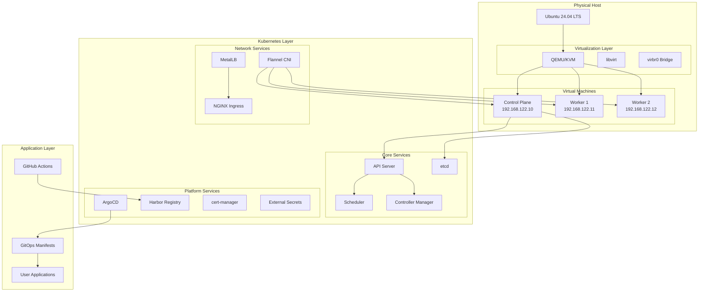
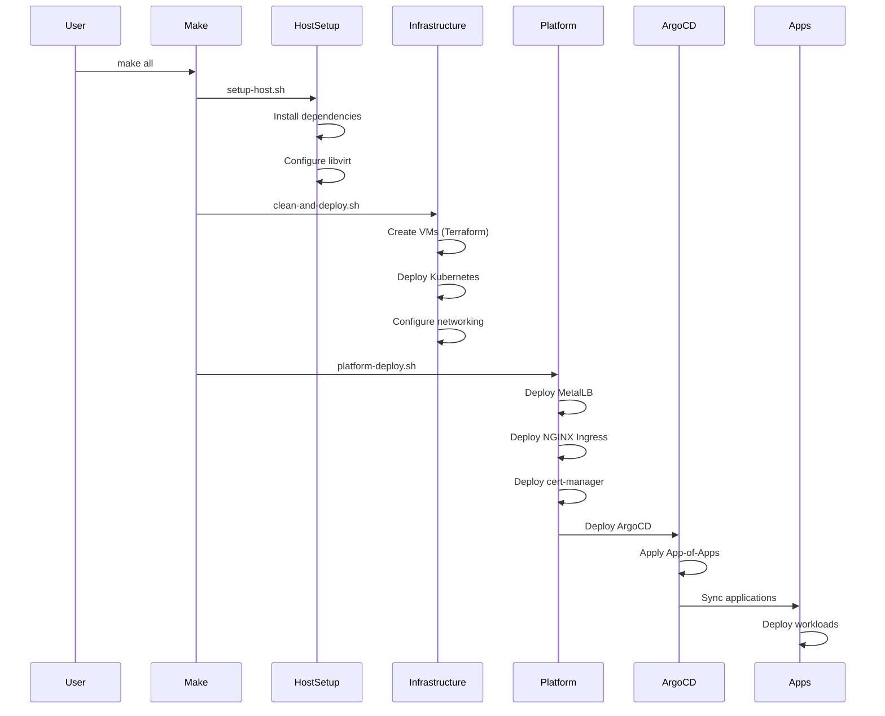

# 🏗️ k8s_myHome アーキテクチャ概要

## 📌 設計思想

k8s_myHomeは以下の設計原則に基づいて構築されています：

1. **Infrastructure as Code (IaC)**: すべてのインフラをコードで管理
2. **GitOps**: 宣言的な構成管理とデプロイメント
3. **フェーズベース構築**: 段階的な環境構築による安定性確保
4. **自己完結型**: 外部依存を最小限に抑えた設計
5. **観測可能性**: 包括的なロギングとモニタリング

## 🎯 システム全体像

## 🔧 コンポーネント階層

### レイヤー1: ホストインフラストラクチャ
- **Ubuntu 24.04 LTS**: ベースOS
- **QEMU/KVM**: ハイパーバイザー
- **libvirt**: 仮想化管理
- **ストレージプール**: /var/lib/libvirt/images

### レイヤー2: 仮想マシン
| VM名 | 役割 | リソース | IPアドレス |
|------|------|----------|-----------|
| k8s-control-plane-1 | マスターノード | 4 CPU, 8GB RAM, 50GB | 192.168.122.10 |
| k8s-worker-1 | ワーカーノード | 2 CPU, 4GB RAM, 30GB | 192.168.122.11 |
| k8s-worker-2 | ワーカーノード | 2 CPU, 4GB RAM, 30GB | 192.168.122.12 |

### レイヤー3: Kubernetes基盤
- **Kubernetes v1.29.0**: コンテナオーケストレーション
- **Flannel**: Pod間ネットワーク（10.244.0.0/16）
- **containerd**: コンテナランタイム
- **kubelet/kubeadm/kubectl**: Kubernetesツール

### レイヤー4: プラットフォームサービス

#### ネットワーキング
- **MetalLB**: LoadBalancerタイプサービス実装
  - IPプール: 192.168.122.100-150
  - モード: L2 Advertisement
- **NGINX Ingress Controller**: L7ロードバランシング
  - LoadBalancer IP: 192.168.122.100

#### セキュリティ & 証明書
- **cert-manager**: 自動証明書管理
  - Self-signed ClusterIssuer
  - Let's Encrypt対応準備
- **External Secrets Operator**: シークレット管理
  - Pulumi ESC統合
  - GitHub PAT管理

#### CI/CD & レジストリ
- **ArgoCD**: GitOpsエンジン
  - App-of-Apps パターン
  - 自動同期設定
- **Harbor**: プライベートコンテナレジストリ
  - HTTP/HTTPS両対応
  - プロジェクト別管理
- **Actions Runner Controller**: GitHub Actionsセルフホステッドランナー
  - Docker-in-Docker対応
  - 自動スケーリング

## 📊 デプロイメントフロー

## 🌐 ネットワークトポロジー

詳細は[network-topology.md](network-topology.md)を参照。

### ネットワークセグメント
- **ホストネットワーク**: 192.168.122.0/24 (libvirt default)
- **Podネットワーク**: 10.244.0.0/16 (Flannel)
- **Serviceネットワーク**: 10.96.0.0/12 (Kubernetes default)
- **LoadBalancerプール**: 192.168.122.100-150 (MetalLB)

## 🔄 データフロー

詳細は[data-flow.md](data-flow.md)を参照。

### GitOpsフロー
1. 開発者がGitHubにマニフェストをプッシュ
2. ArgoCDがリポジトリを監視
3. 変更検出時に自動同期
4. Kubernetesクラスターに適用
5. ステータスをArgoCDダッシュボードに反映

### CI/CDフロー
1. GitHub Actionsでビルドトリガー
2. セルフホステッドランナーで実行
3. Dockerイメージビルド
4. Harborレジストリにプッシュ
5. ArgoCDが新イメージをデプロイ

## 🔒 セキュリティアーキテクチャ

### 認証・認可
- **Kubernetes RBAC**: 細かい権限制御
- **ServiceAccount**: Pod別の権限管理
- **GitHub OAuth**: ArgoCD認証統合

### ネットワークセキュリティ
- **Network Policies**: Pod間通信制御（計画中）
- **TLS/SSL**: cert-managerによる自動証明書管理
- **Ingress制御**: NGINX Ingressでのアクセス制御

### シークレット管理
- **External Secrets Operator**: 外部シークレット統合
- **Sealed Secrets**: GitOps対応暗号化（オプション）

## 📈 スケーラビリティ

### 水平スケーリング
- **ワーカーノード追加**: Terraform設定変更で簡単追加
- **HPA**: Horizontal Pod Autoscaler対応
- **ARC Runner**: 負荷に応じた自動スケール

### 垂直スケーリング
- **VM リソース調整**: terraform.tfvars編集
- **PVC拡張**: StorageClass設定で動的拡張

## 🔍 監視・可観測性

### ロギング
- **kubelet logs**: systemd journal
- **Pod logs**: kubectl logs
- **ArgoCD logs**: アプリケーション同期ログ

### モニタリング（計画中）
- **Prometheus**: メトリクス収集
- **Grafana**: 可視化ダッシュボード
- **AlertManager**: アラート管理

## 🔄 高可用性設計

### 現在の構成
- シングルコントロールプレーン（開発環境向け）
- 2ワーカーノードによる冗長性

### 本番環境向け拡張案
- マルチマスター構成（3ノード）
- 外部etcdクラスター
- 専用ロードバランサー

## 📚 関連ドキュメント

- [ネットワークトポロジー詳細](network-topology.md)
- [コンポーネント図](component-diagram.md)
- [データフロー詳細](data-flow.md)
- [デプロイメントガイド](../operations/deployment-guide.md)

---
*最終更新: 2025-01-09*