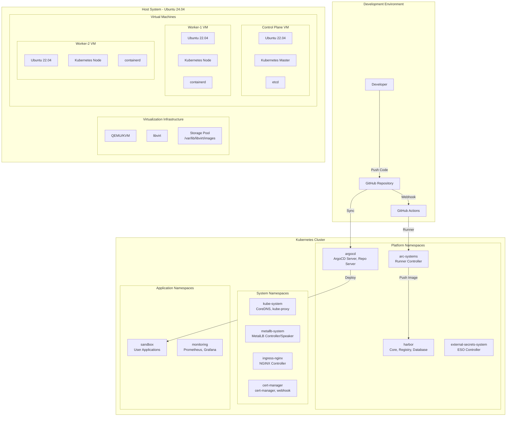
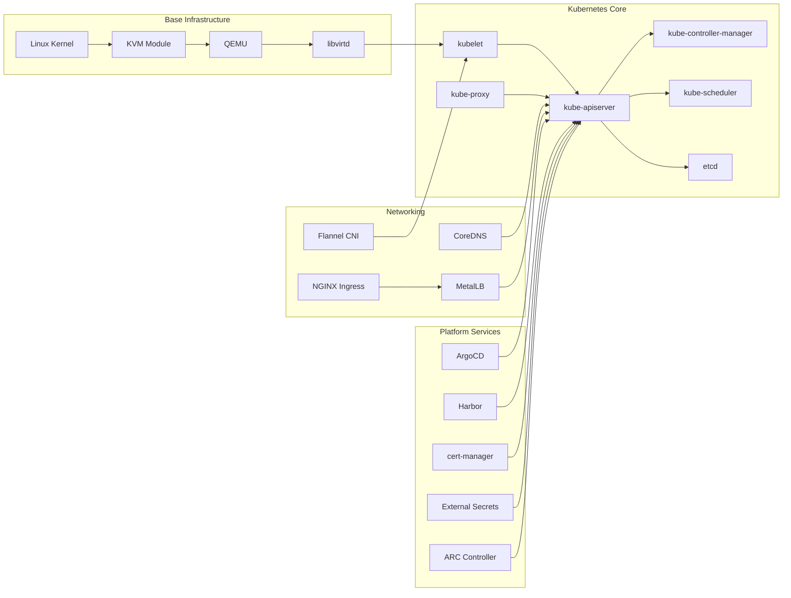
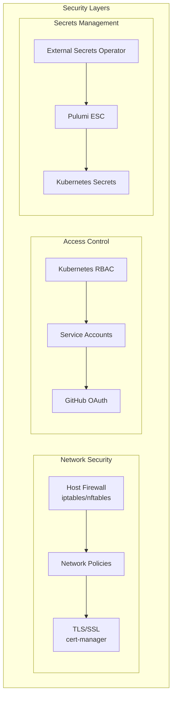

# 🔧 コンポーネント図

## システムコンポーネント全体図



## コンポーネント依存関係



## デプロイメントコンポーネント詳細

### 1. Host Setup コンポーネント

| スクリプト | 機能 | 依存関係 |
|-----------|------|----------|
| setup-host.sh | 基本パッケージインストール | apt, systemd |
| setup-libvirt-sudo.sh | libvirt権限設定 | libvirt, sudo |
| setup-storage.sh | ストレージプール作成 | libvirt, virsh |
| verify-setup.sh | セットアップ検証 | すべての上記 |

### 2. Infrastructure コンポーネント

```hcl
# Terraform構成
module "infrastructure" {
  providers = {
    libvirt = libvirt
  }
  
  components = {
    network     = "default (NAT)"
    storage     = "default pool"
    vms = {
      control_plane = {
        cpu    = 4
        memory = 8192
        disk   = 53687091200
      }
      workers = {
        count  = 2
        cpu    = 2
        memory = 4096
        disk   = 32212254720
      }
    }
  }
}
```

### 3. Platform コンポーネント

```yaml
# Platform Services構成
components:
  networking:
    - name: metallb
      namespace: metallb-system
      chart: metallb/metallb
      values:
        ipAddressPool: 192.168.122.100-150
        
    - name: ingress-nginx
      namespace: ingress-nginx
      chart: ingress-nginx/ingress-nginx
      values:
        service.type: LoadBalancer
        
  security:
    - name: cert-manager
      namespace: cert-manager
      chart: jetstack/cert-manager
      values:
        installCRDs: true
        
  gitops:
    - name: argocd
      namespace: argocd
      chart: argo/argo-cd
      values:
        server.service.type: ClusterIP
        
  registry:
    - name: harbor
      namespace: harbor
      chart: harbor/harbor
      values:
        expose.type: ingress
        
  secrets:
    - name: external-secrets
      namespace: external-secrets-system
      chart: external-secrets/external-secrets
      
  ci-cd:
    - name: actions-runner-controller
      namespace: arc-systems
      chart: actions-runner-controller/gha-runner-scale-set-controller
```

## Namespace構成

```yaml
# Namespace分離設計
namespaces:
  system:
    - kube-system          # Kubernetesコアコンポーネント
    - kube-node-lease      # ノードリース
    - kube-public          # 公開設定
    - kube-flannel         # CNI
    
  infrastructure:
    - metallb-system       # LoadBalancer
    - ingress-nginx        # Ingress Controller
    - cert-manager         # 証明書管理
    
  platform:
    - argocd              # GitOps
    - harbor              # Registry
    - external-secrets-system  # Secrets
    - arc-systems         # CI/CD Runners
    - arc-runners         # Runner Pods
    
  applications:
    - sandbox             # 開発環境
    - production          # 本番環境（オプション）
    - monitoring          # 監視
```

## Pod配置戦略

```yaml
# アフィニティルール例
apiVersion: apps/v1
kind: Deployment
metadata:
  name: critical-app
spec:
  template:
    spec:
      affinity:
        podAntiAffinity:
          requiredDuringSchedulingIgnoredDuringExecution:
          - labelSelector:
              matchExpressions:
              - key: app
                operator: In
                values:
                - critical-app
            topologyKey: kubernetes.io/hostname
      nodeSelector:
        node-role.kubernetes.io/worker: "true"
      tolerations:
      - key: node-role.kubernetes.io/control-plane
        operator: Exists
        effect: NoSchedule
```

## リソース割り当て

### コントロールプレーン
```yaml
resources:
  etcd:
    requests:
      cpu: 100m
      memory: 256Mi
  apiserver:
    requests:
      cpu: 250m
      memory: 512Mi
  controller-manager:
    requests:
      cpu: 200m
      memory: 256Mi
  scheduler:
    requests:
      cpu: 100m
      memory: 128Mi
```

### プラットフォームサービス
```yaml
resources:
  argocd:
    server:
      requests: {cpu: 100m, memory: 128Mi}
      limits: {cpu: 500m, memory: 512Mi}
    repo-server:
      requests: {cpu: 100m, memory: 256Mi}
      limits: {cpu: 1000m, memory: 1Gi}
      
  harbor:
    core:
      requests: {cpu: 100m, memory: 256Mi}
      limits: {cpu: 1000m, memory: 1Gi}
    registry:
      requests: {cpu: 100m, memory: 256Mi}
      limits: {cpu: 1000m, memory: 2Gi}
      
  metallb:
    controller:
      requests: {cpu: 100m, memory: 100Mi}
    speaker:
      requests: {cpu: 100m, memory: 100Mi}
```

## ストレージアーキテクチャ

```yaml
# StorageClass定義
apiVersion: storage.k8s.io/v1
kind: StorageClass
metadata:
  name: local-path
  annotations:
    storageclass.kubernetes.io/is-default-class: "true"
provisioner: rancher.io/local-path
volumeBindingMode: WaitForFirstConsumer
reclaimPolicy: Delete

# PersistentVolume例
volumes:
  harbor-database:
    size: 5Gi
    accessMode: ReadWriteOnce
    storageClass: local-path
    
  harbor-registry:
    size: 20Gi
    accessMode: ReadWriteOnce
    storageClass: local-path
    
  argocd-repo:
    size: 1Gi
    accessMode: ReadWriteOnce
    storageClass: local-path
```

## セキュリティコンポーネント



## 監視コンポーネント（計画中）

```yaml
# Monitoring Stack
components:
  metrics:
    - prometheus-operator
    - prometheus
    - node-exporter
    - kube-state-metrics
    
  visualization:
    - grafana
    - grafana-dashboards
    
  logging:
    - fluent-bit
    - elasticsearch
    - kibana
    
  tracing:
    - jaeger
    - opentelemetry-collector
```

## バックアップ・リカバリコンポーネント

```bash
# バックアップ対象
backup_targets:
  - /var/lib/libvirt/images/  # VM images
  - /etc/kubernetes/          # K8s configs
  - etcd snapshot             # Cluster state
  - PersistentVolumes         # Application data
  - Harbor registry           # Container images
  - ArgoCD configs           # GitOps state
```

---
*最終更新: 2025-01-09*