# 🔄 データフロー

## 概要

k8s_myHomeにおけるデータフローは、GitOpsを中心とした宣言的な構成管理と、CI/CDパイプラインによる継続的デリバリーを実現しています。

## 主要データフローパターン

### 1. GitOpsデータフロー

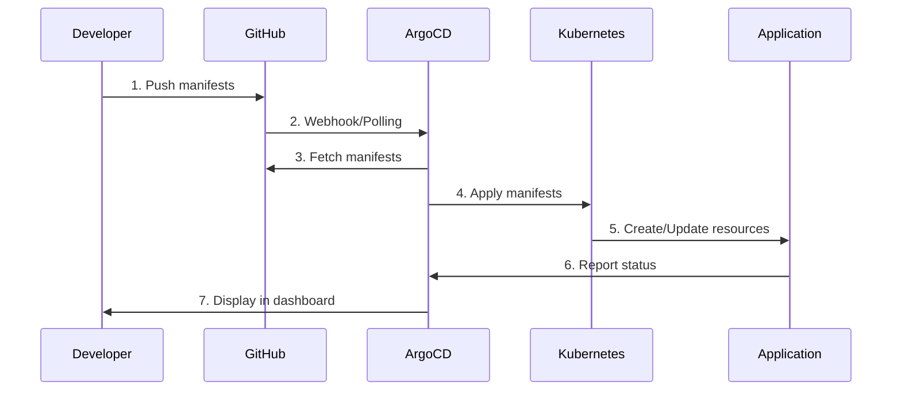

### 2. CI/CDデータフロー

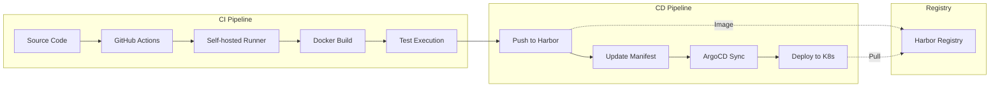

### 3. シークレット管理フロー

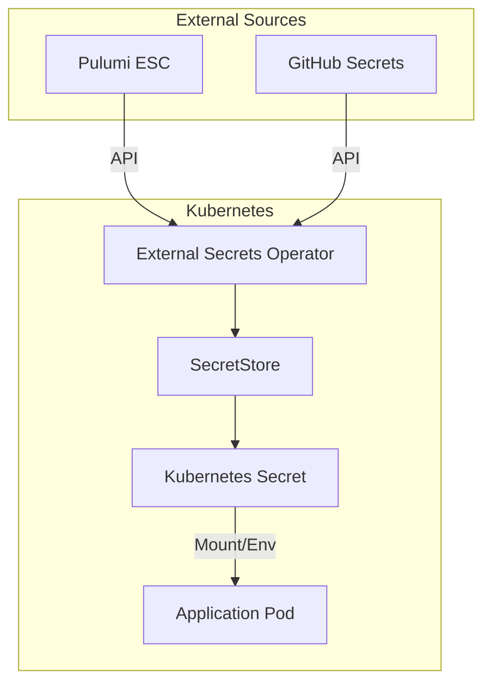

## 詳細データフロー

### アプリケーションデプロイメントフロー

```yaml
# 1. 開発者がマニフェストを作成
apiVersion: argoproj.io/v1alpha1
kind: Application
metadata:
  name: my-app
  namespace: argocd
spec:
  source:
    repoURL: https://github.com/ksera524/k8s_myHome
    path: manifests/apps/my-app
    targetRevision: HEAD
  destination:
    server: https://kubernetes.default.svc
    namespace: sandbox
  syncPolicy:
    automated:
      prune: true
      selfHeal: true
```

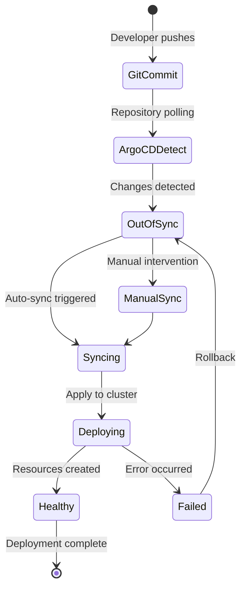

### イメージビルド・プッシュフロー

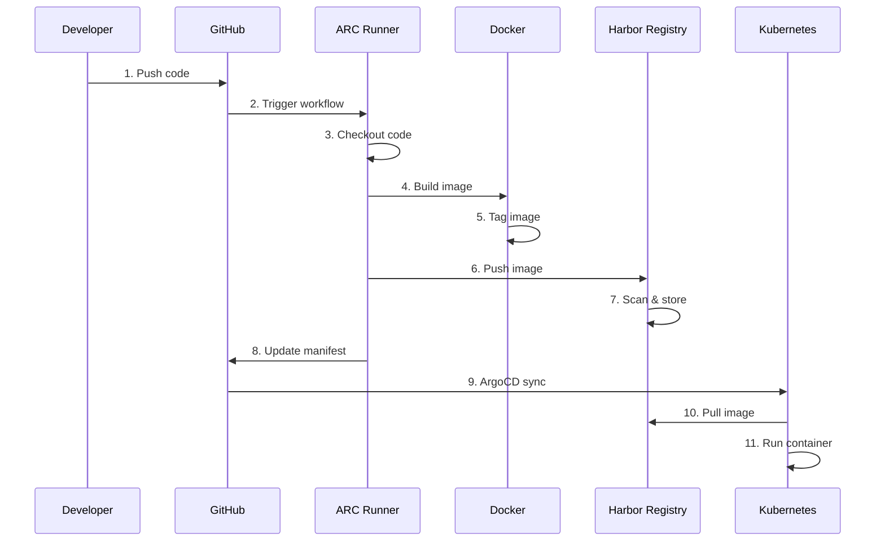

### ネットワークトラフィックフロー

#### Ingressトラフィック
```
1. 外部クライアント
   ↓ (DNS: *.qroksera.com)
2. Cloudflare Tunnel
   ↓ (HTTPS)
3. ホストネットワーク
   ↓ (iptables NAT)
4. MetalLB (192.168.122.100)
   ↓ (L2 Advertisement)
5. NGINX Ingress Controller
   ↓ (Host/Path routing)
6. Kubernetes Service
   ↓ (kube-proxy iptables)
7. Pod (10.244.x.x)
```

#### Pod間通信
```
Pod A (Node 1)
  ↓ (veth pair)
cni0 bridge
  ↓ (Flannel)
VXLAN tunnel (UDP 8472)
  ↓ (Overlay)
cni0 bridge (Node 2)
  ↓ (veth pair)
Pod B (Node 2)
```

### ログ・メトリクスフロー

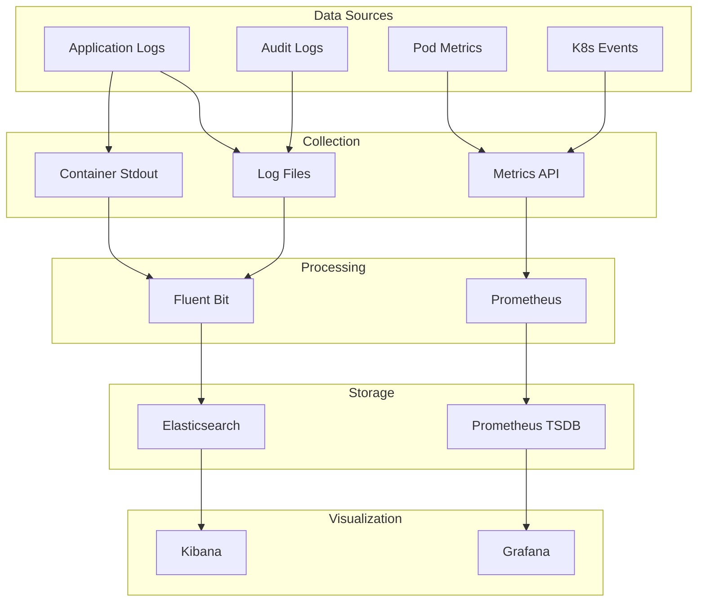

### バックアップ・リストアフロー

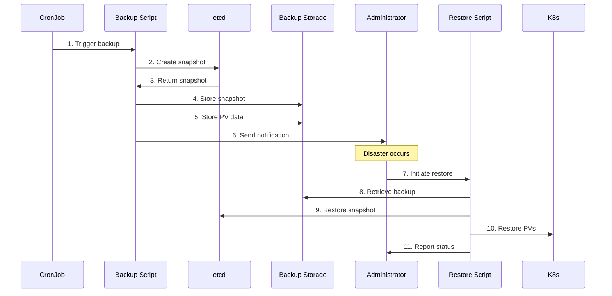

## データ永続化

### PersistentVolumeフロー

```yaml
# PVC作成フロー
apiVersion: v1
kind: PersistentVolumeClaim
metadata:
  name: app-data
spec:
  accessModes:
    - ReadWriteOnce
  resources:
    requests:
      storage: 10Gi
  storageClassName: local-path
```

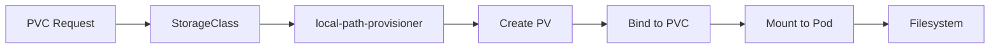

### データベースレプリケーションフロー

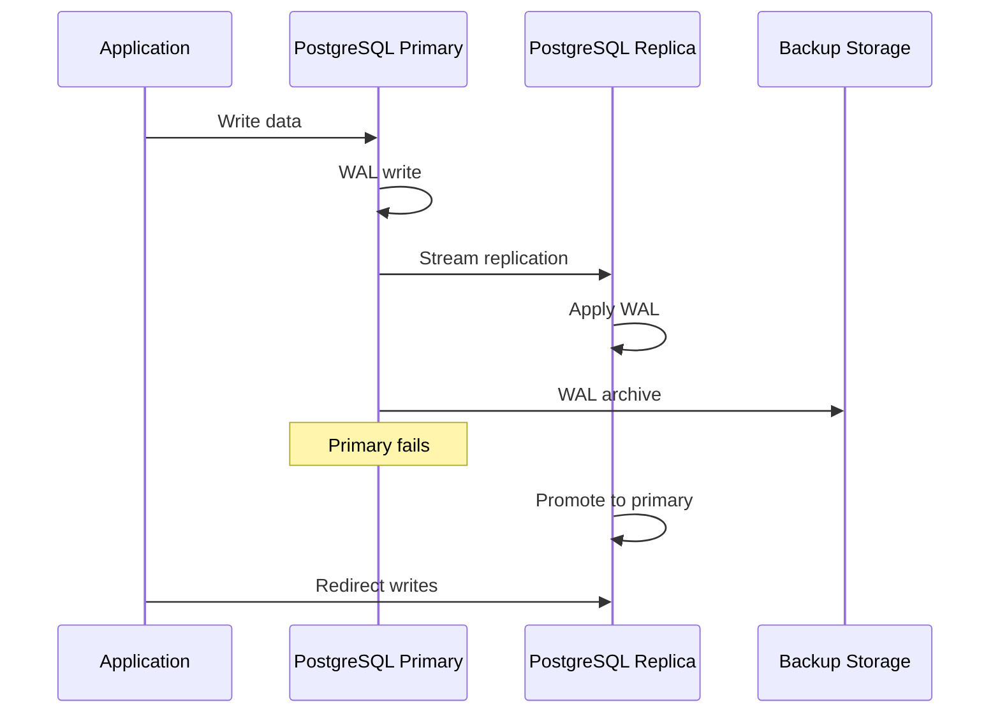

## セキュリティデータフロー

### 認証・認可フロー

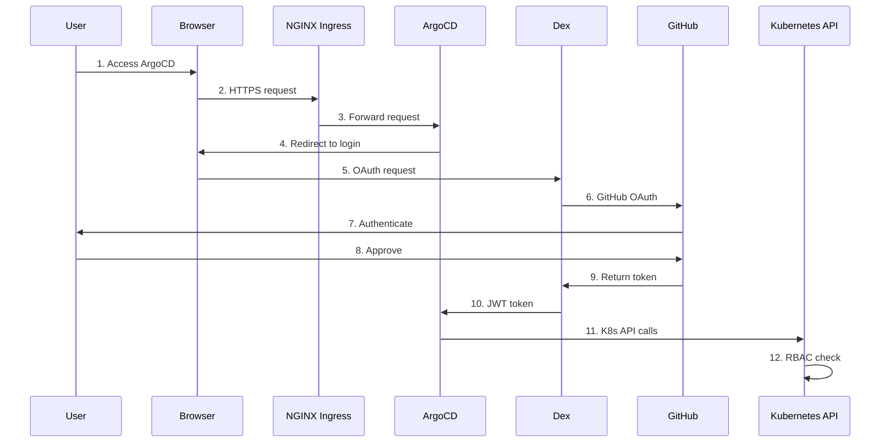

### TLS証明書フロー

```mermaid
graph TB
    subgraph "cert-manager"
        Issuer[ClusterIssuer]
        Cert[Certificate]
        Controller[cert-manager-controller]
    end
    
    subgraph "Ingress"
        Ingress[NGINX Ingress]
        Secret[TLS Secret]
    end
    
    subgraph "Client"
        Browser[Web Browser]
    end
    
    Cert -->|Request| Issuer
    Issuer -->|Generate| Controller
    Controller -->|Create| Secret
    Ingress -->|Use| Secret
    Browser -->|TLS Handshake| Ingress
```

## パフォーマンス最適化されたフロー

### イメージプルフロー最適化

```yaml
# イメージプルポリシー最適化
spec:
  containers:
  - name: app
    image: harbor.local/app:v1.2.3
    imagePullPolicy: IfNotPresent  # ローカルキャッシュ優先
  imagePullSecrets:
  - name: harbor-secret
```

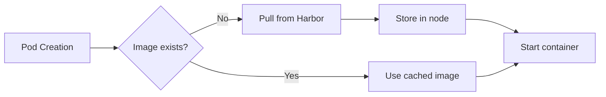

### リクエストルーティング最適化

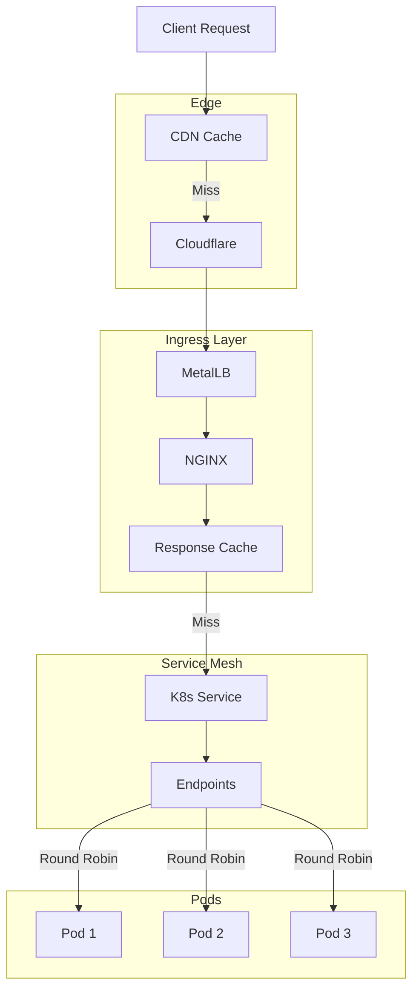

## 障害時のフェイルオーバーフロー

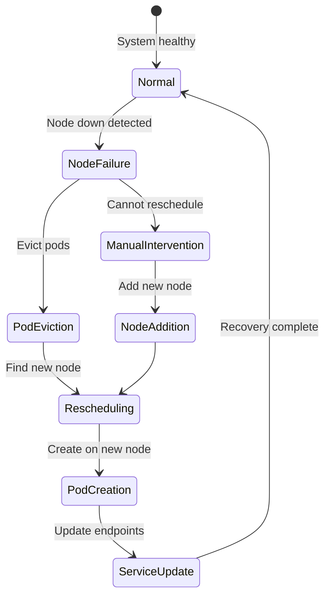

---
*最終更新: 2025-01-09*