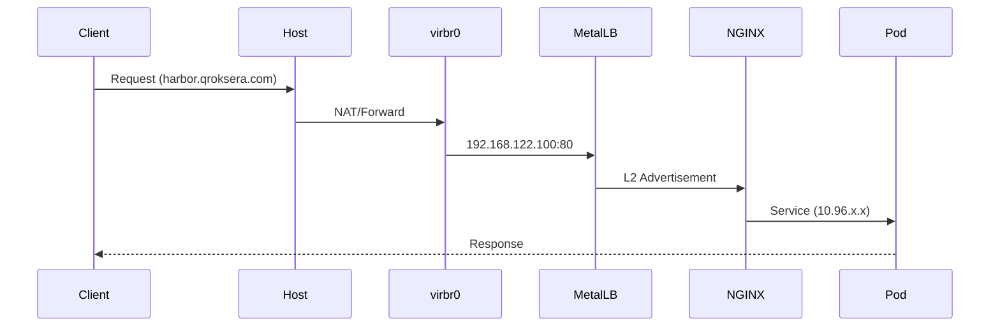
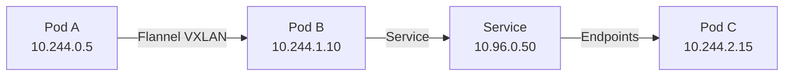

# 🌐 ネットワークトポロジー

## 概要

k8s_myHomeのネットワークアーキテクチャは、libvirtのデフォルトネットワークを基盤とし、Kubernetesのオーバーレイネットワークと統合された多層構造を採用しています。

## ネットワーク構成図

```
┌──────────────────────────────────────────────────────────────┐
│                     インターネット                              │
└────────────┬─────────────────────────────────────────────────┘
             │
      ┌──────▼──────┐
      │   ホストOS   │ 
      │  (ens33等)   │
      └──────┬──────┘
             │
      ┌──────▼──────────────────────────────────────┐
      │        virbr0 (192.168.122.1/24)            │
      │         NAT + DHCP (libvirt)                │
      └──────┬────────────┬────────────┬───────────┘
             │            │            │
     ┌───────▼───┐ ┌──────▼────┐ ┌────▼──────┐
     │Control    │ │ Worker-1  │ │ Worker-2  │
     │Plane      │ │           │ │           │
     │.122.10    │ │ .122.11   │ │ .122.12   │
     └───────────┘ └───────────┘ └───────────┘
             │            │            │
     ┌───────▼────────────▼────────────▼───────┐
     │     Flannel Overlay Network              │
     │         10.244.0.0/16                    │
     └──────────────────────────────────────────┘
             │
     ┌───────▼──────────────────────────────────┐
     │     Kubernetes Service Network           │
     │         10.96.0.0/12                     │
     └──────────────────────────────────────────┘
             │
     ┌───────▼──────────────────────────────────┐
     │        MetalLB IP Pool                   │
     │     192.168.122.100-150                  │
     └──────────────────────────────────────────┘
```

## ネットワークレイヤー詳細

### 1. 物理/ホストネットワーク

| 項目 | 値 | 説明 |
|------|-----|------|
| ホストインターフェース | ens33等 | 物理NICまたは仮想NIC |
| ホストIP | DHCP/Static | 環境依存 |
| ブリッジ | virbr0 | libvirt管理ブリッジ |
| ブリッジIP | 192.168.122.1 | デフォルトゲートウェイ |
| NAT | iptables/nftables | 外部通信用 |

### 2. 仮想マシンネットワーク

```yaml
# ネットワーク設定
network:
  name: default
  mode: nat
  bridge: virbr0
  dhcp:
    range:
      start: 192.168.122.2
      end: 192.168.122.254
  static_ips:
    control-plane: 192.168.122.10
    worker-1: 192.168.122.11
    worker-2: 192.168.122.12
```

### 3. Kubernetes内部ネットワーク

#### Pod Network (Flannel)
```yaml
# Flannel設定
apiVersion: v1
kind: ConfigMap
metadata:
  name: kube-flannel-cfg
  namespace: kube-flannel
data:
  net-conf.json: |
    {
      "Network": "10.244.0.0/16",
      "Backend": {
        "Type": "vxlan",
        "VNI": 1,
        "Port": 8472
      }
    }
```

- **CIDR**: 10.244.0.0/16
- **Backend**: VXLAN
- **ポート**: 8472/UDP
- **ノード割り当て**: /24 per node

#### Service Network
- **CIDR**: 10.96.0.0/12
- **DNS**: 10.96.0.10 (CoreDNS)
- **API Server**: 10.96.0.1

### 4. LoadBalancer Network (MetalLB)

```yaml
# MetalLB IPアドレスプール設定
apiVersion: metallb.io/v1beta1
kind: IPAddressPool
metadata:
  name: default-pool
  namespace: metallb-system
spec:
  addresses:
  - 192.168.122.100-192.168.122.150
```

#### 主要サービスIP割り当て

| サービス | IP | ポート | 用途 |
|---------|-----|--------|------|
| NGINX Ingress | 192.168.122.100 | 80/443 | L7 LoadBalancer |
| Harbor | 192.168.122.100 | 80/443 | Container Registry |
| ArgoCD | 192.168.122.100 | 80/443 | GitOps |

## トラフィックフロー

### 1. 外部→内部 (Ingress)



### 2. Pod間通信 (East-West)



### 3. 外部通信 (Egress)

```
Pod (10.244.x.x) 
  → Node IP (192.168.122.x) 
  → virbr0 (192.168.122.1) 
  → Host NAT 
  → Internet
```

## DNS解決

### 内部DNS (CoreDNS)

```yaml
# CoreDNS設定概要
cluster.local:
  - kubernetes.default.svc.cluster.local → 10.96.0.1
  - harbor.harbor.svc.cluster.local → 10.96.x.x
  - argocd-server.argocd.svc.cluster.local → 10.96.x.x

forward:
  - . → 192.168.122.1 (virbr0)
  - . → 8.8.8.8, 8.8.4.4 (fallback)
```

### 外部DNS解決

1. **ローカル解決** (/etc/hosts)
   ```
   192.168.122.100 harbor.local
   192.168.122.100 harbor.qroksera.com
   192.168.122.100 argocd.qroksera.com
   ```

2. **実際のドメイン** (Cloudflare Tunnel経由)
   - qroksera.com → Cloudflare → Tunnel → Local

## ファイアウォールルール

### iptables/nftables自動設定

```bash
# libvirt自動生成ルール例
-A FORWARD -i virbr0 -j ACCEPT
-A FORWARD -o virbr0 -j ACCEPT
-t nat -A POSTROUTING -s 192.168.122.0/24 ! -d 192.168.122.0/24 -j MASQUERADE

# Kubernetes必要ポート
-A INPUT -p tcp --dport 6443 -j ACCEPT  # API Server
-A INPUT -p tcp --dport 2379:2380 -j ACCEPT  # etcd
-A INPUT -p tcp --dport 10250:10252 -j ACCEPT  # kubelet, controller, scheduler
-A INPUT -p udp --dport 8472 -j ACCEPT  # Flannel VXLAN
-A INPUT -p tcp --dport 30000:32767 -j ACCEPT  # NodePort range
```

## ネットワークトラブルシューティング

### 診断コマンド

```bash
# ノード間疎通確認
kubectl get nodes -o wide
for node in 10 11 12; do ping -c 1 192.168.122.$node; done

# Pod Network確認
kubectl get pods --all-namespaces -o wide
kubectl exec -it <pod> -- ping <other-pod-ip>

# Service確認
kubectl get svc --all-namespaces
kubectl get endpoints --all-namespaces

# MetalLB状態確認
kubectl get ipaddresspool -n metallb-system
kubectl logs -n metallb-system deployment/controller

# DNS確認
kubectl exec -it <pod> -- nslookup kubernetes.default
kubectl exec -it <pod> -- nslookup harbor.harbor.svc.cluster.local
```

### よくある問題と解決策

#### 1. Podが外部通信できない
```bash
# Node上でNAT確認
sudo iptables -t nat -L POSTROUTING -n -v
# Flannelインターフェース確認
ip a show flannel.1
```

#### 2. LoadBalancer IPが割り当てられない
```bash
# MetalLB Speaker確認
kubectl logs -n metallb-system -l app=metallb,component=speaker
# ARP確認
arping 192.168.122.100
```

#### 3. Ingress経由でアクセスできない
```bash
# NGINX Ingress Controller確認
kubectl get svc -n ingress-nginx
kubectl logs -n ingress-nginx deployment/ingress-nginx-controller
```

## パフォーマンス最適化

### MTU設定
```yaml
# Flannel MTU最適化
net-conf.json: |
  {
    "Network": "10.244.0.0/16",
    "Backend": {
      "Type": "vxlan",
      "VNI": 1,
      "Port": 8472,
      "MTU": 1450  # VXLAN overhead考慮
    }
  }
```

### ネットワークポリシー例
```yaml
# 特定namespace間の通信制限
apiVersion: networking.k8s.io/v1
kind: NetworkPolicy
metadata:
  name: deny-all-ingress
  namespace: production
spec:
  podSelector: {}
  policyTypes:
  - Ingress
  ingress: []
```

## 将来の拡張計画

1. **Calico CNI移行**
   - NetworkPolicy完全サポート
   - eBPF高速化

2. **Multi-homing**
   - 複数NIC対応
   - 管理/データプレーン分離

3. **Service Mesh (Istio)**
   - mTLS通信
   - 高度なトラフィック管理

---
*最終更新: 2025-01-09*