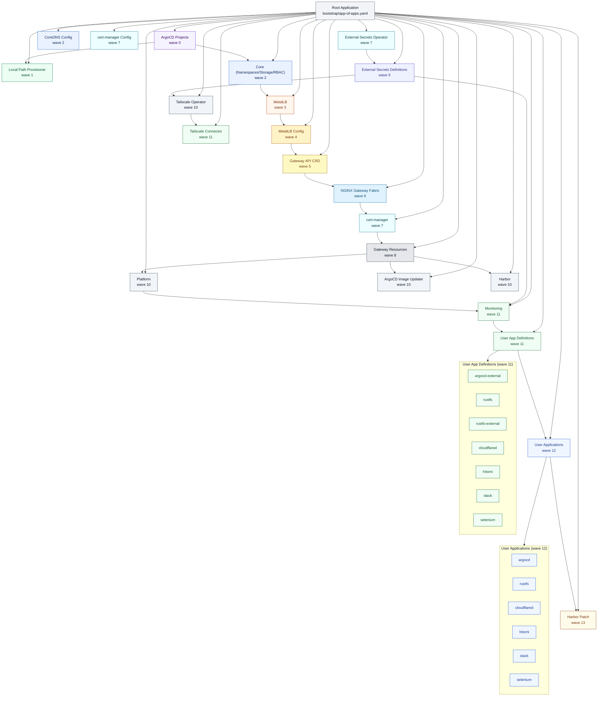

# App-of-Apps 依存関係と Sync Wave

ArgoCD の App-of-Apps 構成と Sync Wave の関係を 1 枚で把握するための図です。
`manifests/bootstrap/app-of-apps.yaml` の定義を基準にしています。

## 依存関係図

## Sync Wave 一覧と意味

| Wave | コンポーネント | 意味/依存関係 |
|------|----------------|--------------|
| 0 | ArgoCD Projects | AppProjectを先に作成 |
| 1 | Local Path Provisioner | 永続ボリューム基盤を先に準備 |
| 2 | Core / CoreDNS | 基本リソースとストレージ設定の土台 |
| 3 | MetalLB | LoadBalancer を提供 |
| 4 | MetalLB Config | IP プール設定を適用 |
| 5 | Gateway API CRD | Gateway API の CRD を先行適用 |
| 6 | NGINX Gateway Fabric | Gateway コントローラー本体 |
| 7 | cert-manager / cert-manager Config / External Secrets Operator | 証明書/Secret 管理を整備 |
| 8 | Gateway Resources | Gateway/共通設定を適用 |
| 9 | External Secrets Definitions | 外部連携用のExternalSecretを適用 |
| 10 | Platform / ArgoCD Image Updater / Harbor / Tailscale Operator | 基盤サービス群の展開 |
| 11 | Monitoring | 監視スタック（Grafana k8s-monitoring） |
| 11 | User App Definitions | ArgoCD Application 定義を作成 |
| 11 | Tailscale Connector | サブネットルータ（k8s内ネットワーク公開） |
| 12 | User Applications | 実アプリのマニフェスト適用 |
| 13 | Harbor Patch | Harbor 後処理パッチ |

## 参照

- `manifests/bootstrap/app-of-apps.yaml`
- `manifests/bootstrap/applications/user-apps/`
