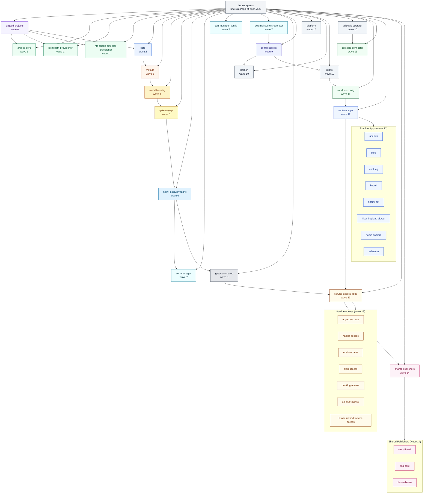

# App-of-Apps 依存関係と Sync Wave

ArgoCD の current main 構成と Sync Wave の関係を 1 枚で把握するための図です。
`manifests/bootstrap/app-of-apps.yaml` と `manifests/bootstrap/applications/**` を基準にしています。

## 依存関係図

```mermaid
flowchart TD
  root["bootstrap-root\nbootstrap/app-of-apps.yaml"]:::root

  wave0["argocd-projects\nwave 0"]:::wave0
  wave1a["argocd-core\nwave 1"]:::wave1
  wave1b["local-path-provisioner\nwave 1"]:::wave1
  wave1c["nfs-subdir-external-provisioner\nwave 1"]:::wave1
  wave2["core\nwave 2"]:::wave2
  wave3["metallb\nwave 3"]:::wave3
  wave4["metallb-config\nwave 4"]:::wave4
  wave5["gateway-api\nwave 5"]:::wave5
  wave6["nginx-gateway-fabric\nwave 6"]:::wave6
  wave7a["cert-manager\nwave 7"]:::wave7
  wave7b["cert-manager-config\nwave 7"]:::wave7
  wave7c["external-secrets-operator\nwave 7"]:::wave7
  wave8["gateway-shared\nwave 8"]:::wave8
  wave9["config-secrets\nwave 9"]:::wave9
  wave10a["platform\nwave 10"]:::wave10
  wave10b["harbor\nwave 10"]:::wave10
  wave10c["rustfs\nwave 10"]:::wave10
  wave10d["tailscale-operator\nwave 10"]:::wave10
  wave11a["sandbox-config\nwave 11"]:::wave11
  wave11b["tailscale-connector\nwave 11"]:::wave11
  wave12["runtime apps\nwave 12"]:::wave12
  wave13["service access apps\nwave 13"]:::wave13
  wave14["shared publishers\nwave 14"]:::wave14

  root --> wave0
  root --> wave1a
  root --> wave1b
  root --> wave1c
  root --> wave2
  root --> wave3
  root --> wave4
  root --> wave5
  root --> wave6
  root --> wave7a
  root --> wave7b
  root --> wave7c
  root --> wave8
  root --> wave9
  root --> wave10a
  root --> wave10b
  root --> wave10c
  root --> wave10d
  root --> wave11a
  root --> wave11b
  root --> wave12
  root --> wave13
  root --> wave14

  wave0 --> wave1a
  wave0 --> wave1b
  wave0 --> wave1c
  wave0 --> wave2
  wave2 --> wave3
  wave3 --> wave4
  wave4 --> wave5
  wave5 --> wave6
  wave6 --> wave7a
  wave6 --> wave8
  wave7c --> wave9
  wave8 --> wave13
  wave9 --> wave10b
  wave9 --> wave10c
  wave10d --> wave11b
  wave10c --> wave11a
  wave11a --> wave12
  wave12 --> wave13
  wave13 --> wave14

  subgraph runtime_apps["Runtime Apps (wave 12)"]
    apiHub["api-hub"]:::wave12
    blog["blog"]:::wave12
    cooklog["cooklog"]:::wave12
    hitomi["hitomi"]:::wave12
    hitomiPdf["hitomi-pdf"]:::wave12
    huv["hitomi-upload-viewer"]:::wave12
    camera["home-camera"]:::wave12
    selenium["selenium"]:::wave12
  end

  subgraph service_access["Service Access (wave 13)"]
    argocdAccess["argocd-access"]:::wave13
    harborAccess["harbor-access"]:::wave13
    rustfsAccess["rustfs-access"]:::wave13
    blogAccess["blog-access"]:::wave13
    cooklogAccess["cooklog-access"]:::wave13
    apiHubAccess["api-hub-access"]:::wave13
    huvAccess["hitomi-upload-viewer-access"]:::wave13
  end

  subgraph shared_publishers["Shared Publishers (wave 14)"]
    cloudflared["cloudflared"]:::wave14
    dnsCore["dns-core"]:::wave14
    dnsTs["dns-tailscale"]:::wave14
  end

  wave12 --> runtime_apps
  wave13 --> service_access
  wave14 --> shared_publishers

  classDef root fill:#f2f4f7,stroke:#475467,stroke-width:1px,color:#101828
  classDef wave0 fill:#f5f3ff,stroke:#6d28d9,stroke-width:1px,color:#3b0764
  classDef wave1 fill:#ecfdf3,stroke:#027a48,stroke-width:1px,color:#054f31
  classDef wave2 fill:#eaf2ff,stroke:#175cd3,stroke-width:1px,color:#102a56
  classDef wave3 fill:#fff6ed,stroke:#c4320a,stroke-width:1px,color:#7a2e0e
  classDef wave4 fill:#fef3c7,stroke:#b45309,stroke-width:1px,color:#78350f
  classDef wave5 fill:#fef9c3,stroke:#a16207,stroke-width:1px,color:#713f12
  classDef wave6 fill:#e0f2fe,stroke:#0369a1,stroke-width:1px,color:#0c4a6e
  classDef wave7 fill:#ecfeff,stroke:#0e7490,stroke-width:1px,color:#0e3a45
  classDef wave8 fill:#e5e7eb,stroke:#374151,stroke-width:1px,color:#111827
  classDef wave9 fill:#eef2ff,stroke:#4338ca,stroke-width:1px,color:#312e81
  classDef wave10 fill:#f1f5f9,stroke:#334155,stroke-width:1px,color:#0f172a
  classDef wave11 fill:#f0fdf4,stroke:#166534,stroke-width:1px,color:#14532d
  classDef wave12 fill:#eff6ff,stroke:#1d4ed8,stroke-width:1px,color:#1e3a8a
  classDef wave13 fill:#fffbeb,stroke:#92400e,stroke-width:1px,color:#78350f
  classDef wave14 fill:#fdf2f8,stroke:#be185d,stroke-width:1px,color:#831843
```

## Sync Wave 一覧

| Wave | コンポーネント | 意味 |
|---|---|---|
| 0 | `argocd-projects` | AppProject を先行適用 |
| 1 | `argocd-core` / storage provisioners | GitOps 基盤とストレージ基盤 |
| 2 | `core` | Namespace / StorageClass / RBAC の土台 |
| 3-7 | infra controllers | MetalLB / Gateway API / NGF / cert-manager / ESO |
| 8 | `gateway-shared` | Gateway / listener 基盤 |
| 9 | `config-secrets` | ExternalSecret 定義 |
| 10 | platform runtime | ARC / Harbor / RustFS / Tailscale operator |
| 11 | 補助 runtime | shared config / tailscale connector |
| 12 | runtime apps | workload-only アプリ |
| 13 | service access | app ごとの HTTPRoute / Harbor / RustFS / ArgoCD 公開 |
| 14 | shared publishers | Cloudflared / CoreDNS / Tailnet DNS |

## 参照

- `manifests/bootstrap/app-of-apps.yaml`
- `manifests/bootstrap/applications/`
