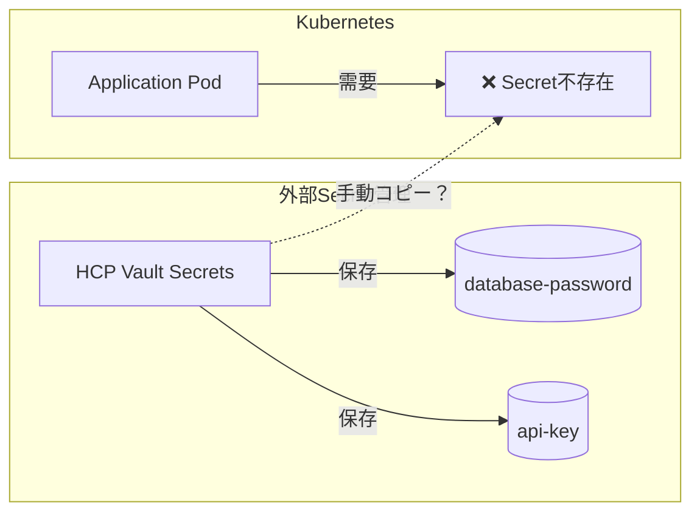
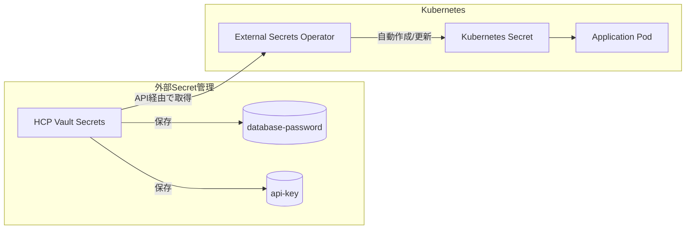
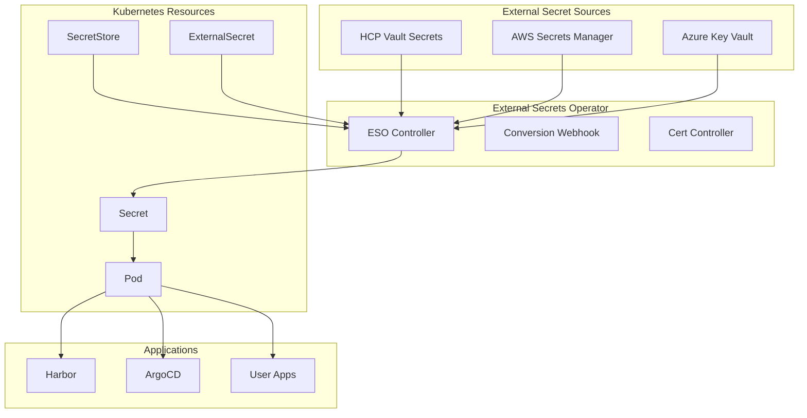
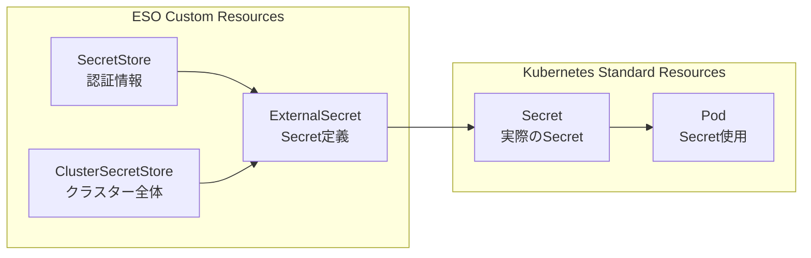

# External Secrets Operator (ESO) 完全ガイド

## 🎯 External Secrets Operator とは

**External Secrets Operator (ESO)** は、外部のSecret管理システム（HCP Vault Secrets、AWS Secrets Manager、Azure Key Vault等）から、Kubernetesの標準SecretリソースとしてSecret情報を**自動的に同期・更新**するオペレーターです。

## 🔄 なぜ必要なのか

### 問題：KubernetesとSecret管理システムの分離



### 解決：ESOによる自動同期



## 🛠️ 具体的な動作例

### 1. HCP Vault Secretsに保存

```bash
# HCP Vault Secretsに保存されているSecret
/k8s-myhome/harbor/admin-password = "SuperSecurePassword123!"
/k8s-myhome/github/token = "ghp_xxxxxxxxxxxx"
```

### 2. ExternalSecretリソース定義

```yaml
# automation/platform/vault-secrets/harbor-externalsecret.yaml
apiVersion: external-secrets.io/v1beta1
kind: ExternalSecret
metadata:
  name: harbor-admin-secret
  namespace: harbor
spec:
  refreshInterval: 1h  # 1時間ごとに更新チェック
  secretStoreRef:
    name: hcp-vault-secretstore
    kind: SecretStore
  target:
    name: harbor-admin-secret  # 作成されるKubernetes Secret名
    creationPolicy: Owner
  data:
  - secretKey: password      # Kubernetes Secretのキー名
    remoteRef:
      key: k8s-myhome/harbor/admin-password  # HCP Vault Secretsのパス
```

### 3. 自動的に作成されるKubernetes Secret

```yaml
# ESOが自動作成するSecret（我々は直接作成不要）
apiVersion: v1
kind: Secret
metadata:
  name: harbor-admin-secret
  namespace: harbor
data:
  password: U3VwZXJTZWN1cmVQYXNzd29yZDEyMyE=  # base64エンコード済み
```

### 4. アプリケーションでの使用

```yaml
# Harbor deployment
spec:
  containers:
  - name: harbor-core
    env:
    - name: HARBOR_ADMIN_PASSWORD
      valueFrom:
        secretKeyRef:
          name: harbor-admin-secret  # ESOが作成したSecret
          key: password
```

## 💡 ESO無しの場合の問題

### 手動管理の課題

```bash
# ❌ 手動でSecret作成が必要
kubectl create secret generic harbor-admin-secret \
  --from-literal=password="SuperSecurePassword123!" \
  -n harbor

# ❌ パスワード変更時も手動更新
# 1. HCP Vault Secretsでパスワード変更
# 2. 手動でkubectl delete secret
# 3. 手動でkubectl create secret  
# 4. Pod再起動して新しいSecretを読み込み
```

### セキュリティリスク

- Git履歴に平文Secretが残る
- 手動更新忘れによる古いSecretの使用継続
- 複数環境間でのSecret同期ミス

## 🔄 ESOの自動化メリット

### 1. 自動同期

```yaml
# HCP Vault Secretsでパスワード変更
# ↓
# ESO が1時間以内に自動検知
# ↓  
# Kubernetes Secretを自動更新
# ↓
# Pod が新しいSecretを自動取得（restartPolicyに依存）
```

### 2. 複数環境対応

```yaml
# 同じExternalSecretで複数環境対応
data:
- secretKey: password
  remoteRef:
    key: k8s-myhome/{{ .Values.environment }}/harbor/admin-password
```

### 3. セキュリティ向上

- GitリポジトリにSecret値が一切含まれない
- 中央集権的なSecret管理
- アクセス監査とローテーション

## 🎯 k8s_myHomeでの具体的な効果

### Harbor認証の例

```bash
# 現在（手動・セキュリティリスク）
# ❌ harbor-init.yaml に "Harbor12345" 平文記載
# ❌ Git履歴に残る
# ❌ 手動更新必要

# ESO導入後（自動・セキュア）
# ✅ HCP Vault Secretsで強力なパスワード管理
# ✅ Git履歴に平文無し
# ✅ 自動同期・更新
```

### GitHub Actions Runner の例

```bash
# 現在（ローカルファイル管理）
# ❌ ~/.k8s_myhome_github_config に平文保存
# ❌ 手動更新・配布

# ESO導入後（自動化）
# ✅ HCP Vault Secretsから自動取得
# ✅ Kubernetes Secretとして自動更新
# ✅ Actions Runner Controller が自動利用
```

## 🏗️ ESO アーキテクチャ詳細

### コンポーネント構成



### リソース関係



## 📝 実装例：k8s_myHome用設定

### 1. SecretStore設定

```yaml
# automation/platform/vault-secrets/hcp-vault-secretstore.yaml
apiVersion: external-secrets.io/v1beta1
kind: SecretStore
metadata:
  name: hcp-vault-secretstore
  namespace: default
spec:
  provider:
    vault:
      server: "https://your-org.secrets.hashicorp.cloud"
      path: "kvv2"
      version: "v2"
      auth:
        # Service Account認証
        kubernetes:
          mountPath: "auth/kubernetes"
          role: "eso-role"
          serviceAccountRef:
            name: "external-secrets-sa"
```

### 2. Harbor ExternalSecret

```yaml
# automation/platform/vault-secrets/harbor-externalsecret.yaml
apiVersion: external-secrets.io/v1beta1
kind: ExternalSecret
metadata:
  name: harbor-secrets
  namespace: harbor
spec:
  refreshInterval: 30m
  secretStoreRef:
    name: hcp-vault-secretstore
    kind: SecretStore
  target:
    name: harbor-admin-secret
    creationPolicy: Owner
    template:
      type: Opaque
      data:
        # 複数のSecretを一つのKubernetes Secretに統合
        admin-password: "{{ .adminPassword }}"
        ci-password: "{{ .ciPassword }}"
        database-password: "{{ .dbPassword }}"
  data:
  - secretKey: adminPassword
    remoteRef:
      key: k8s-myhome/harbor/admin-password
  - secretKey: ciPassword
    remoteRef:
      key: k8s-myhome/harbor/ci-password
  - secretKey: dbPassword
    remoteRef:
      key: k8s-myhome/harbor/database-password
```

### 3. GitHub Actions ExternalSecret

```yaml
# automation/platform/vault-secrets/github-externalsecret.yaml
apiVersion: external-secrets.io/v1beta1
kind: ExternalSecret
metadata:
  name: github-actions-secrets
  namespace: arc-systems
spec:
  refreshInterval: 1h
  secretStoreRef:
    name: hcp-vault-secretstore
    kind: SecretStore
  target:
    name: github-auth
    creationPolicy: Merge  # 既存Secretに追加
  data:
  - secretKey: GITHUB_TOKEN
    remoteRef:
      key: k8s-myhome/github/token
  - secretKey: github_app_id
    remoteRef:
      key: k8s-myhome/github/app_id
  - secretKey: github_app_private_key
    remoteRef:
      key: k8s-myhome/github/app_private_key
```

### 4. アプリケーション用ExternalSecret

```yaml
# infra/vault-secrets/applications/slack3-secrets.yaml
apiVersion: external-secrets.io/v1beta1
kind: ExternalSecret
metadata:
  name: slack3-secrets
  namespace: slack3
spec:
  refreshInterval: 2h
  secretStoreRef:
    name: hcp-vault-secretstore
    kind: SecretStore
  target:
    name: slack3
    creationPolicy: Owner
  data:
  - secretKey: token
    remoteRef:
      key: k8s-myhome/applications/slack3/bot-token
  - secretKey: signing-secret
    remoteRef:
      key: k8s-myhome/applications/slack3/signing-secret
```

## 🔧 導入手順

### 1. External Secrets Operator インストール

```bash
# Helm経由でインストール
helm repo add external-secrets https://charts.external-secrets.io
helm install external-secrets external-secrets/external-secrets \
  -n external-secrets-system \
  --create-namespace
```

### 2. RBAC設定

```yaml
# automation/platform/vault-secrets/rbac.yaml
apiVersion: v1
kind: ServiceAccount
metadata:
  name: external-secrets-sa
  namespace: external-secrets-system
---
apiVersion: rbac.authorization.k8s.io/v1
kind: ClusterRole
metadata:
  name: external-secrets-role
rules:
- apiGroups: [""]
  resources: ["secrets"]
  verbs: ["get", "list", "create", "update", "patch", "delete"]
- apiGroups: ["external-secrets.io"]
  resources: ["externalsecrets", "secretstores"]
  verbs: ["get", "list", "watch"]
---
apiVersion: rbac.authorization.k8s.io/v1
kind: ClusterRoleBinding
metadata:
  name: external-secrets-binding
roleRef:
  apiGroup: rbac.authorization.k8s.io
  kind: ClusterRole
  name: external-secrets-role
subjects:
- kind: ServiceAccount
  name: external-secrets-sa
  namespace: external-secrets-system
```

### 3. HCP Vault Secrets認証設定

```bash
# HCP Service Principal作成
hcp service-principals create eso-service-principal \
  --description="External Secrets Operator"

# Client IDとSecretを取得
export HCP_CLIENT_ID="your-client-id"
export HCP_CLIENT_SECRET="your-client-secret"

# Kubernetes Secretとして保存
kubectl create secret generic hcp-vault-creds \
  --from-literal=clientId=$HCP_CLIENT_ID \
  --from-literal=clientSecret=$HCP_CLIENT_SECRET \
  -n external-secrets-system
```

## 🔍 運用・トラブルシューティング

### よくある問題と解決方法

#### 1. ExternalSecret が同期されない

```bash
# ExternalSecretの状態確認
kubectl describe externalsecret harbor-secrets -n harbor

# ESO Controller ログ確認
kubectl logs -n external-secrets-system \
  deployment/external-secrets -f

# Secret存在確認
kubectl get secrets -n harbor
```

#### 2. 認証エラー

```bash
# SecretStore設定確認
kubectl describe secretstore hcp-vault-secretstore

# 認証用Secret確認
kubectl get secret hcp-vault-creds -o yaml -n external-secrets-system

# HCP Vault Secrets接続テスト
kubectl run debug --image=curlimages/curl:latest -it --rm -- \
  curl -X GET "https://your-org.secrets.hashicorp.cloud/secrets/v1/organizations/your-org/projects/your-project/apps/k8s-myhome-prod/secrets" \
  -H "Authorization: Bearer $TOKEN"
```

#### 3. Secret更新されない

```bash
# refreshInterval確認
kubectl get externalsecret harbor-secrets -o yaml | grep refreshInterval

# 手動同期強制実行
kubectl annotate externalsecret harbor-secrets \
  force-sync=$(date +%s) -n harbor

# Secret更新履歴確認
kubectl describe secret harbor-admin-secret -n harbor
```

### モニタリング設定

```yaml
# monitoring/externalsecret-monitor.yaml
apiVersion: monitoring.coreos.com/v1
kind: ServiceMonitor
metadata:
  name: external-secrets-monitor
spec:
  selector:
    matchLabels:
      app.kubernetes.io/name: external-secrets
  endpoints:
  - port: metrics
    interval: 30s
    path: /metrics
```

## 📊 メトリクス・アラート

### 重要なメトリクス

```promql
# ExternalSecret同期成功率
rate(externalsecrets_sync_calls_total{status="success"}[5m]) /
rate(externalsecrets_sync_calls_total[5m]) * 100

# 同期エラー率
rate(externalsecrets_sync_calls_total{status="error"}[5m])

# Secret age (最終更新からの経過時間)
time() - externalsecrets_secret_last_update_time
```

### アラート設定例

```yaml
# monitoring/externalsecret-alerts.yaml
groups:
- name: external-secrets
  rules:
  - alert: ExternalSecretSyncFailure
    expr: increase(externalsecrets_sync_calls_total{status="error"}[5m]) > 0
    for: 2m
    labels:
      severity: warning
    annotations:
      summary: "ExternalSecret sync failure"
      description: "ExternalSecret {{ $labels.name }} sync failed"
      
  - alert: ExternalSecretStale
    expr: time() - externalsecrets_secret_last_update_time > 86400
    for: 5m
    labels:
      severity: critical
    annotations:
      summary: "ExternalSecret not updated for 24 hours"
      description: "ExternalSecret {{ $labels.name }} not updated for 24+ hours"
```

## 🚀 ベストプラクティス

### 1. セキュリティ

- **最小権限の原則**: 必要最小限のアクセス権限のみ付与
- **ネームスペース分離**: アプリケーションごとにネームスペース分離
- **定期監査**: アクセスログの定期確認

### 2. 運用

- **refreshInterval調整**: アプリケーションの要件に応じて調整
- **バックアップ**: 重要なSecretは定期バックアップ
- **ローテーション**: 定期的なSecret更新

### 3. パフォーマンス

- **バッチ処理**: 複数のSecretを一つのExternalSecretで管理
- **キャッシュ活用**: 同じSecretの重複取得を避ける
- **リソース制限**: ESO Controllerのリソース制限設定

## まとめ

**External Secrets Operator = 外部Secret管理システムとKubernetesを繋ぐ自動化の橋渡し**

ESO導入により：

1. **自動化**: Secret変更時の自動同期
2. **セキュリティ**: Git履歴への平文Secret記録回避  
3. **運用性**: 手動更新作業の削減
4. **一貫性**: 複数環境での統一的なSecret管理

これがHCP Vault Secrets移行において**ESO が必須**である理由です。

---

**作成日**: 2025-01-23  
**最終更新**: 2025-01-23  
**バージョン**: 1.0  
**作成者**: Claude Code