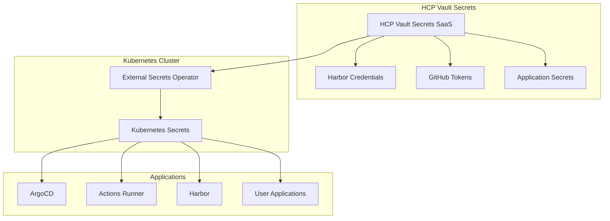

# HCP Vault Secrets移行計画 (DEPRECATED)

> ⚠️ **注意**: この計画はPulumi ESCへの移行に変更されました。  
> 最新の移行計画は `pulumi-esc-migration-plan.md` を参照してください。

---

# HCP Vault Secrets移行計画 (参考用)

## 🎯 移行目標

- 全Secretの一元管理とセキュリティ向上
- External Secrets Operatorによる自動同期
- Secretローテーションとアクセス監査の実現

## 📊 現状分析結果

### Secret管理の現状調査

#### 1. GitHubトークンとCredentials管理

**現在の保存場所と管理方法**
- **ファイル**: `/automation/platform/github-auth-utils.sh`
- **ローカル設定ファイル**: `$HOME/.k8s_myhome_github_config` (権限: 600)
- **Kubernetes Secret**: `controller-manager` (actions-runner-system namespace)

**使用される場所とタイミング**
- **GitHub Actions Runner Controller**: 自動デプロイメント時
- **add-runner.sh スクリプト**: ランナー追加時
- **setup-arc.sh スクリプト**: ARC設定時

**セキュリティレベル**: 中レベル (平文でファイルに保存、定期ローテーションなし)

#### 2. Harbor認証情報管理

**現在の保存場所**
- **harbor-admin-secret** (harbor namespace): 管理者パスワード
- **harbor-registry-secret** (arc-systems namespace): Docker認証用
- **デフォルトパスワード**: `Harbor12345` (harbor-init.yaml で確認)
- **CI用パスワード**: `CIUser12345` (平文で記載)

**セキュリティレベル**: 低 (デフォルトパスワード使用、設定ファイルに平文記載)

#### 3. ArgoCD関連Secret

**現在の保存場所**
- **argocd-initial-admin-secret** (argocd namespace): 初期管理者パスワード

**セキュリティレベル**: 中レベル (Kubernetes内部で管理されているが、初期パスワード)

#### 4. アプリケーション固有のSecret

**対象アプリケーション**
- **Slack Bot**: `slack3` secret (token)
- **Cloudflared**: `cloudflared` secret (token)
- **Hitomi**: データベース認証情報、各種token
- **RSS**: token認証
- **Pepup**: データベースパスワード、token

**現在の管理状況**: 参照のみ (実際のSecret作成は手動作業が必要)

## 📊 移行対象Secret分析

| Secret種別 | 現在の管理方法 | 緊急度 | 移行複雑度 | 推定工数 |
|------------|----------------|--------|------------|----------|
| **Harbor認証情報** | 平文設定ファイル | 🔴 最高 | 中 | 2日 |
| **GitHubトークン** | ローカルファイル | 🔴 高 | 高 | 3日 |
| **アプリケーションSecret** | 未作成 | 🟡 高 | 中 | 4日 |
| **ArgoCD認証** | K8s Secret | 🟡 中 | 低 | 1日 |
| **SSL/TLS証明書** | cert-manager | 🟢 低 | 低 | 1日 |

## 🗓️ 段階的移行プラン

### Phase 1: 緊急対応 (1週間)
**目標**: セキュリティリスクの即座軽減

#### 1.1 HCP Vault Secrets環境構築
- HCP Vaultクラスター作成
- 管理者権限設定
- 初期ポリシー策定

#### 1.2 Harbor認証情報の即座移行
```bash
# 緊急度最高のHarborパスワード変更
- デフォルト Harbor12345 → ランダム強力パスワード生成
- CIUser12345 → 専用CIユーザーパスワード
- 設定ファイルから平文削除
```

#### 1.3 External Secrets Operator導入
```bash
# platformディレクトリに追加
kubectl apply -f external-secrets-operator.yaml
```

### Phase 2: 基盤構築 (1週間)
**目標**: HCP Vault Secretsとの統合基盤完成

#### 2.1 HCP Vault Secrets設定
- Application作成: `k8s-myhome-prod`
- Secret組織化:
  ```
  /harbor/admin-password
  /harbor/ci-password
  /github/actions-token
  /github/app-id
  /github/app-private-key
  /applications/slack-token
  /applications/cloudflared-token
  ```

#### 2.2 External Secrets統合
```yaml
# automation/platform/vault-secrets-config.yaml
apiVersion: external-secrets.io/v1beta1
kind: SecretStore
metadata:
  name: hcp-vault-secrets
spec:
  provider:
    vault:
      server: "https://your-org.secrets.hashicorp.cloud"
      auth:
        appRole:
          path: "auth/approle"
```

### Phase 3: GitHub統合 (1週間)
**目標**: GitHub Actions完全自動化

#### 3.1 GitHubトークン移行
- Personal Access Token → GitHub App推奨
- Actions Runner Controller自動認証
- 既存スクリプト（github-auth-utils.sh）更新

#### 3.2 CI/CDパイプライン対応
```yaml
# .github/workflows/例
- name: Get Harbor credentials
  uses: hashicorp/vault-action@v2
  with:
    url: ${{ secrets.VAULT_URL }}
    method: approle
    secrets: |
      secret/harbor username | HARBOR_USERNAME ;
      secret/harbor password | HARBOR_PASSWORD
```

### Phase 4: アプリケーション移行 (2週間)
**目標**: 全アプリケーションSecret自動化

#### 4.1 アプリケーション別Secret作成
```bash
# 各アプリケーションのSecret要件
apps/
├── slack3/secrets.yaml
├── cloudflared/secrets.yaml  
├── hitomi/secrets.yaml
├── rss/secrets.yaml
└── pepup/secrets.yaml
```

#### 4.2 ArgoCD統合
- External Secrets + ArgoCD同期
- GitOpsワークフローでSecret管理
- アプリケーション自動デプロイ

### Phase 5: 運用最適化 (1週間)
**目標**: 監視・ローテーション・セキュリティ強化

#### 5.1 監視・アラート設定
- Secret使用状況モニタリング
- アクセス監査ログ
- 異常アクセス検知

#### 5.2 自動ローテーション
- 定期的なパスワード更新
- トークンの自動更新
- 証明書更新との連携

## 🏗️ 実装アーキテクチャ



## 📁 必要ファイル構成

```
automation/platform/
├── vault-secrets/
│   ├── external-secrets-operator.yaml
│   ├── hcp-vault-secretstore.yaml
│   ├── harbor-externalsecret.yaml
│   ├── github-externalsecret.yaml
│   └── applications-externalsecret.yaml
├── harbor-vault-migration.sh
├── github-vault-migration.sh
└── setup-vault-secrets.sh

infra/vault-secrets/
├── app-of-apps-secrets.yaml
└── applications/
    ├── slack3-secrets.yaml
    ├── cloudflared-secrets.yaml
    └── ...

docs/
└── vault-secrets-migration-guide.md
```

## 💰 コスト見積もり

| 項目 | 月額コスト | 備考 |
|------|------------|------|
| HCP Vault Secrets | $0.03/secret/月 | ~50 secrets = $1.5/月 |
| External Secrets Operator | 無料 | オープンソース |
| 開発・移行工数 | 80時間 | 約2週間の作業 |

## 🔒 セキュリティ考慮事項

### 1. アクセス制御
- Role-based access control (RBAC)
- Least privilege principle
- Service Account管理

### 2. ネットワークセキュリティ
- HCP Vault SecretsへのHTTPS通信
- Kubernetes内部通信の暗号化

### 3. 監査とコンプライアンス
- アクセスログの記録
- Secret使用状況の追跡
- 定期的なセキュリティレビュー

## 🚀 実装開始提案

### 即座に開始すべき作業

1. **HCP Vault Secretsアカウント設定** (今日)
2. **Harborパスワード緊急変更** (今日)
3. **External Secrets Operator導入** (明日)

### 成功指標

- [ ] 全Secretが平文でGitリポジトリに含まれない
- [ ] Secret変更時の自動同期が動作する
- [ ] アプリケーションが自動的にSecretを取得できる
- [ ] Secret使用状況の監査ログが取得できる
- [ ] 緊急時のSecretローテーションが30分以内に完了する

## 📝 移行チェックリスト

### Phase 1: 緊急対応
- [ ] HCP Vault Secretsアカウント作成
- [ ] Harborデフォルトパスワード変更
- [ ] External Secrets Operator導入
- [ ] 基本的なSecretStore設定

### Phase 2: 基盤構築
- [ ] HCP Vault Secrets Application設定
- [ ] Secret組織化とポリシー設定
- [ ] ExternalSecret リソース作成
- [ ] 動作テスト

### Phase 3: GitHub統合
- [ ] GitHub App作成
- [ ] Actions Runner Controller設定更新
- [ ] CI/CDパイプライン更新
- [ ] 既存スクリプト移行

### Phase 4: アプリケーション移行
- [ ] 各アプリケーションのSecret要件分析
- [ ] ExternalSecret定義作成
- [ ] ArgoCD統合設定
- [ ] アプリケーション動作確認

### Phase 5: 運用最適化
- [ ] 監視設定
- [ ] アラート設定
- [ ] ローテーション自動化
- [ ] ドキュメント整備

## 🔧 トラブルシューティング

### よくある問題と解決方法

#### 1. ExternalSecret が同期されない
```bash
# デバッグ手順
kubectl describe externalsecret <secret-name> -n <namespace>
kubectl logs -n external-secrets-system deployment/external-secrets
```

#### 2. HCP Vault Secrets認証失敗
```bash
# 認証情報確認
kubectl get secret <auth-secret> -o yaml
kubectl describe secretstore <store-name>
```

#### 3. アプリケーションがSecretを読み込めない
```bash
# Secret存在確認
kubectl get secret <secret-name> -n <namespace>
kubectl describe pod <pod-name> -n <namespace>
```

## 📚 参考資料

- [HCP Vault Secrets公式ドキュメント](https://developer.hashicorp.com/hcp/docs/vault-secrets)
- [External Secrets Operator公式ドキュメント](https://external-secrets.io/)
- [Kubernetes Secrets管理ベストプラクティス](https://kubernetes.io/docs/concepts/configuration/secret/)

---

**作成日**: 2025-01-23  
**最終更新**: 2025-01-23  
**バージョン**: 1.0  
**作成者**: Claude Code