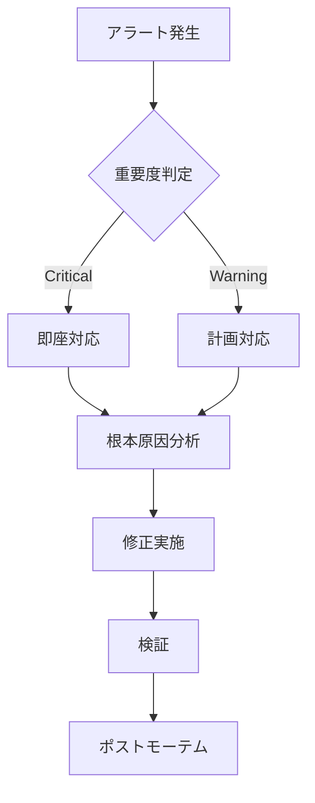

# 保守性向上 実装ロードマップ

## 🎯 2025年 Q1 実装計画

### Week 1-2: 基礎固め
#### ドキュメント整備
```bash
# ドキュメント構造作成
mkdir -p docs/{architecture,operations,development,api}

# README.md改善
docs/
├── README.md                    # プロジェクト概要
├── QUICKSTART.md                # クイックスタート
├── architecture/
│   ├── README.md                # アーキテクチャ概要
│   ├── network-topology.md      # ネットワーク構成
│   ├── component-diagram.md     # コンポーネント図
│   └── data-flow.md            # データフロー
├── operations/
│   ├── deployment-guide.md      # デプロイ手順
│   ├── troubleshooting.md      # トラブルシューティング
│   ├── backup-restore.md       # バックアップ・リストア
│   └── disaster-recovery.md    # 災害復旧
└── development/
    ├── setup.md                 # 開発環境構築
    ├── contributing.md          # コントリビューション
    └── coding-standards.md      # コーディング規約
```

#### エラーハンドリング標準化
```bash
# automation/lib/error-handler.sh
#!/bin/bash

# グローバルエラーハンドラー
trap_error() {
    local exit_code=$?
    local line_no=$1
    echo "ERROR: Command failed with exit code $exit_code at line $line_no" >&2
    echo "Stack trace:" >&2
    local frame=0
    while caller $frame; do
        ((frame++))
    done
    exit $exit_code
}

trap 'trap_error $LINENO' ERR

# リトライ機能
retry_command() {
    local max_attempts=$1
    local delay=$2
    local command="${@:3}"
    local attempt=0
    
    until [[ $attempt -ge $max_attempts ]]; do
        if eval "$command"; then
            return 0
        fi
        ((attempt++))
        echo "Attempt $attempt failed. Retrying in $delay seconds..."
        sleep $delay
    done
    
    echo "Command failed after $max_attempts attempts"
    return 1
}
```

### Week 3-4: テスト基盤構築

#### テストフレームワーク導入
```bash
# test/setup.sh
#!/bin/bash

# BATSインストール
git clone https://github.com/bats-core/bats-core.git /tmp/bats-core
cd /tmp/bats-core
./install.sh /usr/local

# テストヘルパー
cat > test/test_helper.bash << 'EOF'
load '/usr/local/lib/bats-support/load'
load '/usr/local/lib/bats-assert/load'

# テスト用の一時ディレクトリ
setup() {
    export TEST_TEMP_DIR="$(mktemp -d)"
}

teardown() {
    rm -rf "$TEST_TEMP_DIR"
}
EOF
```

#### サンプルテストケース
```bash
# test/unit/test_validation.bats
#!/usr/bin/env bats

load ../test_helper

@test "IP address validation" {
    source automation/lib/validation.sh
    
    run validate_ip "192.168.122.10"
    assert_success
    
    run validate_ip "999.999.999.999"
    assert_failure
}

@test "Port range validation" {
    source automation/lib/validation.sh
    
    run validate_port 8080
    assert_success
    
    run validate_port 99999
    assert_failure
}
```

### Month 2: CI/CD & 監視

#### GitHub Actions ワークフロー
```yaml
# .github/workflows/ci.yml
name: CI Pipeline

on:
  push:
    branches: [main, develop]
  pull_request:
    branches: [main]

jobs:
  validate:
    runs-on: ubuntu-latest
    steps:
      - uses: actions/checkout@v3
      
      - name: Validate Shell Scripts
        run: |
          find . -name "*.sh" -exec shellcheck {} \;
      
      - name: Validate YAML
        run: |
          yamllint manifests/
      
      - name: Validate Kubernetes Manifests
        run: |
          kubeval manifests/**/*.yaml

  test:
    runs-on: ubuntu-latest
    steps:
      - uses: actions/checkout@v3
      
      - name: Setup BATS
        run: |
          npm install -g bats
      
      - name: Run Unit Tests
        run: |
          bats test/unit/*.bats
      
      - name: Test Coverage Report
        run: |
          bashcov bats test/unit/*.bats

  security:
    runs-on: ubuntu-latest
    steps:
      - uses: actions/checkout@v3
      
      - name: Run Trivy Security Scan
        uses: aquasecurity/trivy-action@master
        with:
          scan-type: 'fs'
          scan-ref: '.'
      
      - name: Check for Secrets
        run: |
          pip install detect-secrets
          detect-secrets scan --baseline .secrets.baseline
```

#### Prometheusメトリクス実装
```yaml
# manifests/monitoring/prometheus-values.yaml
prometheus:
  prometheusSpec:
    serviceMonitorSelector:
      matchLabels:
        prometheus: kube-prometheus
    
    additionalScrapeConfigs:
    - job_name: 'k8s-myhome-custom'
      static_configs:
      - targets:
        - 'harbor.local:9090'
        - 'argocd-metrics.argocd:8082'
    
    retention: 30d
    
    storageSpec:
      volumeClaimTemplate:
        spec:
          accessModes: ["ReadWriteOnce"]
          resources:
            requests:
              storage: 50Gi
          storageClassName: local-path

alertmanager:
  alertmanagerSpec:
    storage:
      volumeClaimTemplate:
        spec:
          accessModes: ["ReadWriteOnce"]
          resources:
            requests:
              storage: 10Gi
          storageClassName: local-path

grafana:
  adminPassword: ${GRAFANA_ADMIN_PASSWORD}
  persistence:
    enabled: true
    size: 10Gi
  
  dashboardProviders:
    dashboardproviders.yaml:
      apiVersion: 1
      providers:
      - name: 'default'
        orgId: 1
        folder: ''
        type: file
        disableDeletion: false
        editable: true
        options:
          path: /var/lib/grafana/dashboards/default
  
  dashboards:
    default:
      cluster-overview:
        url: https://grafana.com/api/dashboards/7249/revisions/1/download
      argocd:
        url: https://grafana.com/api/dashboards/14584/revisions/1/download
```

### Month 3: 高度な自動化

#### Helm Chart開発
```yaml
# charts/k8s-myhome/Chart.yaml
apiVersion: v2
name: k8s-myhome
description: Complete Home Kubernetes Infrastructure
type: application
version: 1.0.0
appVersion: "2025.1"

dependencies:
  - name: metallb
    version: 0.13.12
    repository: https://metallb.github.io/metallb
    condition: metallb.enabled
  
  - name: ingress-nginx
    version: 4.8.2
    repository: https://kubernetes.github.io/ingress-nginx
    condition: ingress.enabled
  
  - name: cert-manager
    version: 1.13.3
    repository: https://charts.jetstack.io
    condition: certManager.enabled
  
  - name: argo-cd
    version: 5.51.6
    repository: https://argoproj.github.io/argo-helm
    condition: argocd.enabled
  
  - name: harbor
    version: 1.13.1
    repository: https://helm.goharbor.io
    condition: harbor.enabled
```

#### values.yaml テンプレート
```yaml
# charts/k8s-myhome/values.yaml
global:
  domain: k8s.local
  storageClass: local-path

metallb:
  enabled: true
  configInline:
    address-pools:
    - name: default
      protocol: layer2
      addresses:
      - 192.168.122.100-192.168.122.150

ingress:
  enabled: true
  controller:
    service:
      type: LoadBalancer
      loadBalancerIP: 192.168.122.100

certManager:
  enabled: true
  installCRDs: true

argocd:
  enabled: true
  server:
    extraArgs:
      - --insecure
    config:
      repositories: |
        - type: git
          url: https://github.com/ksera524/k8s_myHome.git

harbor:
  enabled: true
  expose:
    type: ingress
    ingress:
      hosts:
        core: harbor.{{ .Values.global.domain }}
  externalURL: http://harbor.{{ .Values.global.domain }}
  persistence:
    persistentVolumeClaim:
      registry:
        storageClass: "{{ .Values.global.storageClass }}"
        size: 100Gi
```

## 📊 メトリクス収集

### カスタムメトリクス定義
```go
// metrics/collector.go
package metrics

import (
    "github.com/prometheus/client_golang/prometheus"
    "github.com/prometheus/client_golang/prometheus/promauto"
)

var (
    deploymentsTotal = promauto.NewCounter(prometheus.CounterOpts{
        Name: "k8s_myhome_deployments_total",
        Help: "Total number of deployments",
    })
    
    deploymentDuration = promauto.NewHistogram(prometheus.HistogramOpts{
        Name: "k8s_myhome_deployment_duration_seconds",
        Help: "Duration of deployments in seconds",
    })
    
    clusterHealth = promauto.NewGaugeVec(prometheus.GaugeOpts{
        Name: "k8s_myhome_cluster_health",
        Help: "Cluster health status (1=healthy, 0=unhealthy)",
    }, []string{"component"})
)
```

### ダッシュボード定義
```json
{
  "dashboard": {
    "title": "k8s_myHome Overview",
    "panels": [
      {
        "title": "Deployment Success Rate",
        "targets": [
          {
            "expr": "rate(k8s_myhome_deployments_success[5m]) / rate(k8s_myhome_deployments_total[5m])"
          }
        ]
      },
      {
        "title": "Average Deployment Time",
        "targets": [
          {
            "expr": "histogram_quantile(0.95, k8s_myhome_deployment_duration_seconds)"
          }
        ]
      },
      {
        "title": "Cluster Component Health",
        "targets": [
          {
            "expr": "k8s_myhome_cluster_health"
          }
        ]
      }
    ]
  }
}
```

## 🔐 セキュリティ強化

### SOPS導入 (Secret暗号化)
```bash
# .sops.yaml
creation_rules:
  - path_regex: .*\.enc\.yaml$
    age: age1xxxxxxxxxxxxxxxxxxxxxxxxxxxxxxxxxxxxxxxxxxxxxxxxxxxxxxxx

# 使用例
sops -e manifests/secrets/database.yaml > manifests/secrets/database.enc.yaml
```

### NetworkPolicy実装
```yaml
# manifests/security/network-policies.yaml
apiVersion: networking.k8s.io/v1
kind: NetworkPolicy
metadata:
  name: default-deny-all
  namespace: default
spec:
  podSelector: {}
  policyTypes:
  - Ingress
  - Egress
---
apiVersion: networking.k8s.io/v1
kind: NetworkPolicy
metadata:
  name: allow-harbor-ingress
  namespace: harbor
spec:
  podSelector:
    matchLabels:
      app: harbor
  policyTypes:
  - Ingress
  ingress:
  - from:
    - namespaceSelector:
        matchLabels:
          name: ingress-nginx
    - podSelector:
        matchLabels:
          app.kubernetes.io/name: ingress-nginx
    ports:
    - protocol: TCP
      port: 80
```

### Pod Security Standards
```yaml
# manifests/security/pod-security-policy.yaml
apiVersion: policy/v1beta1
kind: PodSecurityPolicy
metadata:
  name: restricted
spec:
  privileged: false
  allowPrivilegeEscalation: false
  requiredDropCapabilities:
    - ALL
  volumes:
    - 'configMap'
    - 'emptyDir'
    - 'projected'
    - 'secret'
    - 'downwardAPI'
    - 'persistentVolumeClaim'
  runAsUser:
    rule: 'MustRunAsNonRoot'
  seLinux:
    rule: 'RunAsAny'
  fsGroup:
    rule: 'RunAsAny'
  readOnlyRootFilesystem: true
```

## 📈 パフォーマンス最適化

### リソース制限テンプレート
```yaml
# manifests/templates/resource-limits.yaml
resources:
  requests:
    memory: "64Mi"
    cpu: "250m"
  limits:
    memory: "128Mi"
    cpu: "500m"
```

### HPA (Horizontal Pod Autoscaler)
```yaml
# manifests/autoscaling/hpa.yaml
apiVersion: autoscaling/v2
kind: HorizontalPodAutoscaler
metadata:
  name: app-hpa
spec:
  scaleTargetRef:
    apiVersion: apps/v1
    kind: Deployment
    name: app
  minReplicas: 2
  maxReplicas: 10
  metrics:
  - type: Resource
    resource:
      name: cpu
      target:
        type: Utilization
        averageUtilization: 70
  - type: Resource
    resource:
      name: memory
      target:
        type: Utilization
        averageUtilization: 80
```

### VPA (Vertical Pod Autoscaler)
```yaml
# manifests/autoscaling/vpa.yaml
apiVersion: autoscaling.k8s.io/v1
kind: VerticalPodAutoscaler
metadata:
  name: app-vpa
spec:
  targetRef:
    apiVersion: apps/v1
    kind: Deployment
    name: app
  updatePolicy:
    updateMode: "Auto"
  resourcePolicy:
    containerPolicies:
    - containerName: app
      minAllowed:
        cpu: 100m
        memory: 50Mi
      maxAllowed:
        cpu: 1
        memory: 500Mi
```

## 🚨 障害対応プレイブック

### インシデント対応フロー


### トラブルシューティングチェックリスト
```bash
#!/bin/bash
# troubleshoot.sh

echo "=== Cluster Health Check ==="
kubectl get nodes
kubectl get pods --all-namespaces | grep -v Running

echo "=== Resource Usage ==="
kubectl top nodes
kubectl top pods --all-namespaces

echo "=== Recent Events ==="
kubectl get events --all-namespaces --sort-by='.lastTimestamp'

echo "=== Storage Status ==="
kubectl get pv,pvc --all-namespaces

echo "=== Network Connectivity ==="
kubectl run test-pod --image=busybox --rm -it --restart=Never -- wget -O- http://harbor.local

echo "=== Logs Analysis ==="
stern --all-namespaces --since 1h | grep -i error
```

## 📅 メンテナンススケジュール

### 定期メンテナンスタスク
| タスク | 頻度 | 自動化 | 担当 |
|--------|------|--------|------|
| バックアップ | 日次 | ✓ | CronJob |
| セキュリティパッチ | 週次 | ✓ | Renovate |
| 証明書更新 | 月次 | ✓ | cert-manager |
| ログローテーション | 日次 | ✓ | logrotate |
| メトリクス集計 | リアルタイム | ✓ | Prometheus |
| 容量監視 | 日次 | ✓ | AlertManager |
| 災害復旧テスト | 四半期 | ✗ | 手動 |

---

最終更新: 2025-01-07
次回レビュー: 2025-02-01