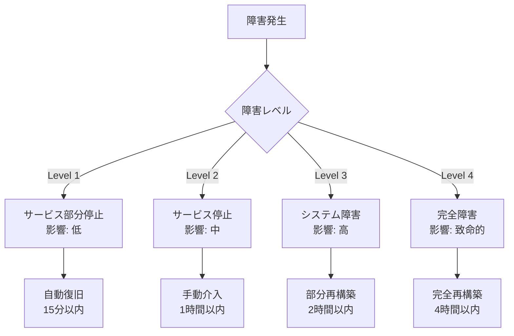
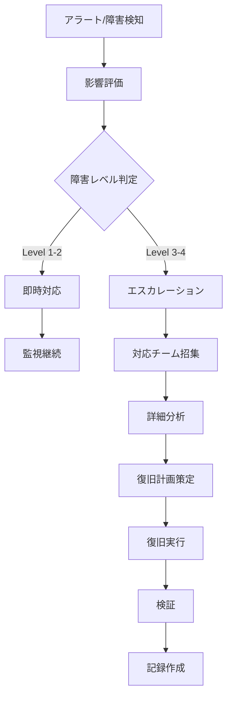
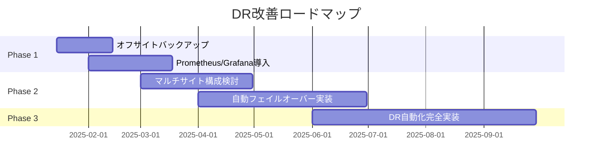

# 🚨 災害復旧（DR）ガイド

## 概要

k8s_myHomeシステムにおける災害復旧計画（DRP: Disaster Recovery Plan）を定義し、各種障害シナリオに対する復旧手順を提供します。

## DR戦略

### 復旧目標

| メトリクス | 目標値 | 説明 |
|-----------|--------|------|
| **RTO** (Recovery Time Objective) | 4時間 | システム復旧までの目標時間 |
| **RPO** (Recovery Point Objective) | 24時間 | 許容可能なデータ損失期間 |
| **MTTR** (Mean Time To Recovery) | 2時間 | 平均復旧時間 |
| **可用性目標** | 99.5% | 年間稼働率（約43時間のダウンタイム許容） |

### 障害レベル分類



## 障害シナリオと対応

### Level 1: サービス部分停止

#### シナリオ: Pod異常終了
```bash
# 検知
kubectl get pods --all-namespaces | grep -v Running

# 自動復旧（ReplicaSet/Deploymentによる）
# 手動介入が必要な場合
kubectl rollout restart deployment/<name> -n <namespace>

# 確認
kubectl get events -n <namespace> --sort-by='.lastTimestamp'
```

#### シナリオ: 一時的なネットワーク障害
```bash
# 検知
kubectl get endpoints --all-namespaces

# 復旧
kubectl rollout restart daemonset/kube-proxy -n kube-system
kubectl rollout restart deployment/coredns -n kube-system

# 確認
for pod in $(kubectl get pods -n kube-system -o name); do
  kubectl exec -n kube-system $pod -- nslookup kubernetes.default
done
```

### Level 2: サービス停止

#### シナリオ: ワーカーノード障害

```bash
#!/bin/bash
# worker-node-recovery.sh

FAILED_NODE=$1

# 1. ノード状態確認
kubectl get node ${FAILED_NODE}
kubectl describe node ${FAILED_NODE}

# 2. Podを他ノードへ退避
kubectl drain ${FAILED_NODE} --ignore-daemonsets --delete-emptydir-data

# 3. ノード復旧試行
ssh k8suser@${FAILED_NODE} "
  sudo systemctl restart kubelet
  sudo systemctl restart containerd
"

# 4. 復旧確認（5分待機）
sleep 300
if kubectl get node ${FAILED_NODE} | grep -q "Ready"; then
  echo "ノード復旧成功"
  kubectl uncordon ${FAILED_NODE}
else
  echo "ノード復旧失敗 - VM再作成が必要"
  # VM再作成手順へ
fi
```

#### シナリオ: ArgoCD障害

```bash
# 1. ArgoCD Pod確認
kubectl get pods -n argocd

# 2. ArgoCD完全再起動
kubectl delete pods -n argocd --all

# 3. 復旧待機と確認
kubectl wait --for=condition=ready pod -l app.kubernetes.io/name=argocd-server -n argocd --timeout=300s

# 4. アプリケーション同期状態確認
kubectl get applications -n argocd

# 5. 手動同期（必要な場合）
for app in $(kubectl get applications -n argocd -o jsonpath='{.items[*].metadata.name}'); do
  kubectl patch application $app -n argocd --type merge -p '{"operation":{"sync":{}}}'
done
```

### Level 3: システム障害

#### シナリオ: etcd障害

```bash
#!/bin/bash
# etcd-disaster-recovery.sh

# 1. etcd状態確認
kubectl exec -n kube-system etcd-k8s-control-plane-1 -- \
  etcdctl --endpoints=https://127.0.0.1:2379 \
  --cacert=/etc/kubernetes/pki/etcd/ca.crt \
  --cert=/etc/kubernetes/pki/etcd/server.crt \
  --key=/etc/kubernetes/pki/etcd/server.key \
  member list

# 2. 健全なメンバーからバックアップ取得
HEALTHY_MEMBER="etcd-k8s-control-plane-1"
kubectl exec -n kube-system ${HEALTHY_MEMBER} -- \
  etcdctl [...] snapshot save /tmp/emergency-backup.db

# 3. etcdクラスター停止
sudo systemctl stop etcd

# 4. データディレクトリクリア
sudo rm -rf /var/lib/etcd/member

# 5. スナップショットからリストア
sudo ETCDCTL_API=3 etcdctl snapshot restore /tmp/emergency-backup.db \
  --name k8s-control-plane-1 \
  --initial-cluster k8s-control-plane-1=https://192.168.122.10:2380 \
  --initial-advertise-peer-urls https://192.168.122.10:2380 \
  --data-dir /var/lib/etcd

# 6. etcd再起動
sudo chown -R etcd:etcd /var/lib/etcd
sudo systemctl start etcd

# 7. クラスター確認
kubectl get cs
kubectl get nodes
```

#### シナリオ: コントロールプレーン完全障害

```bash
#!/bin/bash
# control-plane-rebuild.sh

# 1. 新VM作成
cd automation/infrastructure
terraform destroy -target=libvirt_domain.k8s-control-plane
terraform apply -target=libvirt_domain.k8s-control-plane

# 2. 新コントロールプレーン初期化
ssh k8suser@192.168.122.10 << 'EOF'
sudo kubeadm init \
  --apiserver-advertise-address=192.168.122.10 \
  --pod-network-cidr=10.244.0.0/16 \
  --service-cidr=10.96.0.0/12 \
  --upload-certs
EOF

# 3. etcdバックアップからリストア
scp /backup/latest/etcd-snapshot.db k8suser@192.168.122.10:/tmp/
ssh k8suser@192.168.122.10 << 'EOF'
sudo systemctl stop etcd
sudo rm -rf /var/lib/etcd/member
sudo ETCDCTL_API=3 etcdctl snapshot restore /tmp/etcd-snapshot.db \
  --data-dir /var/lib/etcd
sudo chown -R etcd:etcd /var/lib/etcd
sudo systemctl start etcd
EOF

# 4. ワーカーノード再参加
for worker in 192.168.122.11 192.168.122.12; do
  ssh k8suser@${worker} "sudo kubeadm reset -f"
  ssh k8suser@${worker} "sudo kubeadm join 192.168.122.10:6443 --token <token> --discovery-token-ca-cert-hash <hash>"
done
```

### Level 4: 完全障害

#### シナリオ: ホストマシン障害

```bash
#!/bin/bash
# complete-disaster-recovery.sh

# 前提: 新しいホストマシンが準備済み
# バックアップデータが外部ストレージから利用可能

set -e

log() {
    echo "[$(date +'%Y-%m-%d %H:%M:%S')] $1"
}

# 1. 新ホスト準備
prepare_new_host() {
    log "新ホスト準備開始..."
    
    # OS更新
    sudo apt update && sudo apt upgrade -y
    
    # 必要なパッケージインストール
    cd k8s_myHome/automation/host-setup
    ./setup-host.sh
    ./setup-libvirt-sudo.sh
    ./setup-storage.sh
    ./verify-setup.sh
    
    log "新ホスト準備完了"
}

# 2. インフラストラクチャ再構築
rebuild_infrastructure() {
    log "インフラストラクチャ再構築開始..."
    
    cd ../infrastructure
    terraform init
    terraform apply -auto-approve
    
    # クラスター初期化待機
    sleep 600
    
    log "インフラストラクチャ再構築完了"
}

# 3. バックアップからリストア
restore_from_backup() {
    log "バックアップリストア開始..."
    
    # 最新バックアップ取得
    LATEST_BACKUP=$(ls -t /backup/*.tar.gz | head -1)
    
    # リストア実行
    /usr/local/bin/k8s-restore.sh ${LATEST_BACKUP}
    
    log "バックアップリストア完了"
}

# 4. プラットフォームサービス再デプロイ
redeploy_platform() {
    log "プラットフォームサービス再デプロイ開始..."
    
    cd ../platform
    ./platform-deploy.sh
    
    log "プラットフォームサービス再デプロイ完了"
}

# 5. 検証
verify_recovery() {
    log "復旧検証開始..."
    
    # ノード確認
    kubectl get nodes
    
    # システムPod確認
    kubectl get pods -n kube-system
    
    # アプリケーション確認
    kubectl get applications -n argocd
    
    # サービス疎通確認
    curl -I http://192.168.122.100
    
    log "復旧検証完了"
}

# メイン処理
main() {
    log "完全災害復旧開始"
    
    prepare_new_host
    rebuild_infrastructure
    restore_from_backup
    redeploy_platform
    verify_recovery
    
    log "完全災害復旧完了"
}

# 実行確認
read -p "完全災害復旧を開始しますか？ [y/N]: " confirm
if [ "$confirm" = "y" ]; then
    main
else
    echo "中止しました"
    exit 0
fi
```

## 復旧手順書

### 初動対応フロー



### 連絡体制

```yaml
# 障害レベル別連絡先
escalation:
  level1:
    - 担当者メール通知
    - Slack通知
  level2:
    - 担当者電話連絡
    - チームSlackチャンネル
  level3:
    - マネージャー連絡
    - 緊急対応チーム招集
  level4:
    - 経営層報告
    - 全社通知
```

## 予防措置

### 定期訓練

```bash
#!/bin/bash
# dr-drill.sh - 月次DR訓練スクリプト

# 1. バックアップ確認
echo "=== バックアップ確認 ==="
ls -la /backup/*.tar.gz | tail -5

# 2. テスト環境でリストア演習
echo "=== テスト環境リストア ==="
kubectl create namespace dr-test
kubectl apply -f /backup/test-resources.yaml -n dr-test

# 3. フェイルオーバーテスト
echo "=== フェイルオーバーテスト ==="
kubectl drain k8s-worker-1 --ignore-daemonsets
sleep 60
kubectl get pods --all-namespaces -o wide | grep k8s-worker-2
kubectl uncordon k8s-worker-1

# 4. 結果記録
echo "=== 訓練結果 ==="
echo "実施日: $(date)" >> /var/log/dr-drill.log
echo "所要時間: XX分" >> /var/log/dr-drill.log
echo "問題点: なし/あり（詳細）" >> /var/log/dr-drill.log
```

### 監視強化

```yaml
# Prometheus AlertManager設定
global:
  resolve_timeout: 5m

route:
  group_by: ['alertname', 'cluster', 'service']
  group_wait: 10s
  group_interval: 10s
  repeat_interval: 12h
  receiver: 'default'
  routes:
  - match:
      severity: critical
    receiver: 'critical'
    continue: true
  - match:
      severity: warning
    receiver: 'warning'

receivers:
- name: 'default'
  slack_configs:
  - api_url: '$SLACK_WEBHOOK_URL'
    channel: '#alerts'

- name: 'critical'
  pagerduty_configs:
  - service_key: '$PAGERDUTY_KEY'
  slack_configs:
  - api_url: '$SLACK_WEBHOOK_URL'
    channel: '#critical-alerts'

- name: 'warning'
  email_configs:
  - to: 'team@example.com'
```

## 復旧後作業

### チェックリスト

- [ ] 全サービス稼働確認
- [ ] データ整合性確認
- [ ] バックアップ再設定
- [ ] 監視アラート確認
- [ ] ログ収集・分析
- [ ] インシデントレポート作成
- [ ] 改善点の特定
- [ ] DRPの更新

### インシデントレポートテンプレート

```markdown
# インシデントレポート

## 概要
- **発生日時**: YYYY-MM-DD HH:MM
- **復旧完了時刻**: YYYY-MM-DD HH:MM
- **影響時間**: XX時間XX分
- **障害レベル**: Level X
- **影響範囲**: 

## タイムライン
- HH:MM - 障害検知
- HH:MM - 初動対応開始
- HH:MM - 原因特定
- HH:MM - 復旧作業開始
- HH:MM - サービス復旧
- HH:MM - 完全復旧確認

## 原因分析
### 直接原因
### 根本原因
### 寄与要因

## 対応内容
### 即時対応
### 恒久対策

## 改善提案
1. 
2. 
3. 

## 学んだ教訓
```

## DR成熟度評価

### 現在のレベル

| 評価項目 | レベル | 改善点 |
|---------|--------|--------|
| バックアップ自動化 | ★★★★☆ | オフサイトバックアップ追加 |
| 復旧手順文書化 | ★★★★★ | - |
| 監視・アラート | ★★★☆☆ | Prometheus/Grafana導入 |
| 訓練実施 | ★★★☆☆ | 月次訓練の定着 |
| RTO/RPO達成 | ★★★★☆ | RTOさらなる短縮 |

### 改善ロードマップ



---
*最終更新: 2025-01-09*