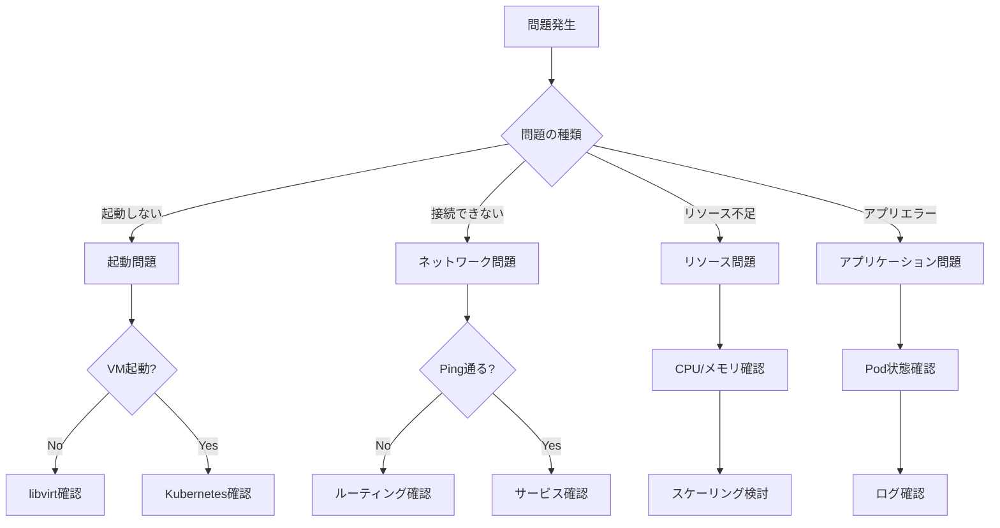

# 🔧 トラブルシューティングガイド

## 概要

k8s_myHomeで発生する可能性のある問題と、その解決方法を体系的にまとめたガイドです。

## 問題診断フローチャート



## カテゴリ別トラブルシューティング

## 1. インフラストラクチャ問題

### 1.1 VM起動問題

#### 症状: VMが起動しない
```bash
# 状態確認
sudo virsh list --all
# 期待: running状態でない
```

**解決方法:**
```bash
# 1. libvirtサービス確認
sudo systemctl status libvirtd
sudo systemctl restart libvirtd

# 2. ネットワーク確認
sudo virsh net-list --all
sudo virsh net-start default

# 3. ストレージ確認
sudo virsh pool-list --all
df -h /var/lib/libvirt/images

# 4. VM強制起動
sudo virsh start k8s-control-plane-1

# 5. エラーログ確認
sudo journalctl -u libvirtd -n 100
sudo virsh domblklist k8s-control-plane-1
```

#### 症状: VMがクラッシュする
```bash
# メモリ不足チェック
free -h
sudo virsh dominfo k8s-control-plane-1
```

**解決方法:**
```bash
# 1. リソース調整
sudo virsh setmem k8s-control-plane-1 6G --config
sudo virsh setvcpus k8s-control-plane-1 3 --config

# 2. VM再作成
cd automation/infrastructure
terraform destroy -target=libvirt_domain.k8s-control-plane-1
terraform apply
```

### 1.2 ストレージ問題

#### 症状: ディスク容量不足
```bash
# エラー例
Error: cannot create volume: Storage volume allocation error
```

**解決方法:**
```bash
# 1. 使用状況確認
df -h
du -sh /var/lib/libvirt/images/*

# 2. 不要なイメージ削除
sudo virsh vol-list default
sudo virsh vol-delete --pool default <volume-name>

# 3. ストレージプール拡張
sudo virsh pool-destroy default
sudo virsh pool-undefine default
# setup-storage.sh編集して容量変更
./automation/host-setup/setup-storage.sh
```

## 2. Kubernetesクラスター問題

### 2.1 ノード問題

#### 症状: Node Not Ready
```bash
kubectl get nodes
# NAME                  STATUS     ROLES
# k8s-worker-1          NotReady   <none>
```

**解決方法:**
```bash
# 1. ノード詳細確認
kubectl describe node k8s-worker-1

# 2. SSH接続して確認
ssh k8suser@192.168.122.11

# 3. kubelet状態確認
sudo systemctl status kubelet
sudo journalctl -u kubelet -n 100

# 4. コンテナランタイム確認
sudo systemctl status containerd
sudo crictl ps

# 5. ネットワーク確認
ip a show flannel.1
sudo systemctl restart systemd-networkd

# 6. kubelet再起動
sudo systemctl restart kubelet
```

#### 症状: etcdエラー
```bash
# ログ例
etcdserver: mvcc: database space exceeded
```

**解決方法:**
```bash
# 1. etcdコンパクション
kubectl exec -n kube-system etcd-k8s-control-plane-1 -- \
  etcdctl --endpoints=https://127.0.0.1:2379 \
  --cacert=/etc/kubernetes/pki/etcd/ca.crt \
  --cert=/etc/kubernetes/pki/etcd/server.crt \
  --key=/etc/kubernetes/pki/etcd/server.key \
  compact $(etcdctl [...] endpoint status --write-out="json" | jq -r '.[] | .Status.header.revision')

# 2. デフラグ
kubectl exec -n kube-system etcd-k8s-control-plane-1 -- \
  etcdctl [...] defrag

# 3. スナップショット作成
kubectl exec -n kube-system etcd-k8s-control-plane-1 -- \
  etcdctl [...] snapshot save /var/lib/etcd/backup.db
```

### 2.2 ネットワーク問題

#### 症状: Pod間通信不可
```bash
# テスト
kubectl run test-pod --image=busybox --rm -it -- sh
ping <other-pod-ip>
```

**解決方法:**
```bash
# 1. CNI確認
kubectl get pods -n kube-flannel
kubectl logs -n kube-flannel -l app=flannel

# 2. iptables確認
sudo iptables -L -n -v | grep FORWARD
sudo iptables -t nat -L -n -v

# 3. Flannel再デプロイ
kubectl delete -f https://github.com/flannel-io/flannel/releases/latest/download/kube-flannel.yml
kubectl apply -f https://github.com/flannel-io/flannel/releases/latest/download/kube-flannel.yml
```

#### 症状: Service接続不可
```bash
kubectl get svc
# ClusterIPにアクセスできない
```

**解決方法:**
```bash
# 1. Endpoints確認
kubectl get endpoints <service-name>

# 2. kube-proxy確認
kubectl get pods -n kube-system -l k8s-app=kube-proxy
kubectl logs -n kube-system -l k8s-app=kube-proxy

# 3. iptables rules確認
sudo iptables-save | grep <service-cluster-ip>

# 4. kube-proxy再起動
kubectl rollout restart daemonset/kube-proxy -n kube-system
```

## 3. プラットフォームサービス問題

### 3.1 ArgoCD問題

#### 症状: アプリケーション同期失敗
```bash
kubectl get applications -n argocd
# STATUS: OutOfSync, Degraded
```

**解決方法:**
```bash
# 1. 詳細確認
kubectl describe application <app-name> -n argocd

# 2. 手動同期
kubectl patch application <app-name> -n argocd \
  --type merge -p '{"operation":{"sync":{"syncStrategy":{"hook":{}}}}}'

# 3. リポジトリ接続確認
kubectl get secret -n argocd repo-<id> -o yaml

# 4. ArgoCD再起動
kubectl rollout restart deployment -n argocd
```

#### 症状: ArgoCD UIアクセス不可
```bash
# 503 Service Unavailable
```

**解決方法:**
```bash
# 1. Pod状態確認
kubectl get pods -n argocd
kubectl logs -n argocd deployment/argocd-server

# 2. Service確認
kubectl get svc -n argocd
kubectl get ingress -n argocd

# 3. 証明書確認
kubectl get certificate -n argocd
kubectl describe certificate argocd-server-tls -n argocd
```

### 3.2 Harbor問題

#### 症状: イメージプッシュ失敗
```bash
# Error: unauthorized: unauthorized to access repository
```

**解決方法:**
```bash
# 1. 認証情報確認
kubectl get secret harbor-auth -n arc-systems -o yaml

# 2. Harbor Pod確認
kubectl get pods -n harbor
kubectl logs -n harbor deployment/harbor-core

# 3. PVC確認
kubectl get pvc -n harbor
kubectl describe pvc -n harbor

# 4. 証明書確認
kubectl get secret harbor-tls -n harbor
openssl s_client -connect 192.168.122.100:443 -servername harbor.local
```

#### 症状: Harbor起動失敗（PVC Pending）
```bash
kubectl get pvc -n harbor
# STATUS: Pending
```

**解決方法:**
```bash
# 1. StorageClass確認
kubectl get storageclass
kubectl describe storageclass local-path

# 2. PVC再作成
kubectl delete pvc <pvc-name> -n harbor
kubectl apply -f - <<EOF
apiVersion: v1
kind: PersistentVolumeClaim
metadata:
  name: <pvc-name>
  namespace: harbor
spec:
  accessModes:
    - ReadWriteOnce
  resources:
    requests:
      storage: 5Gi
  storageClassName: local-path
EOF
```

### 3.3 MetalLB問題

#### 症状: LoadBalancer IP割り当てられない
```bash
kubectl get svc -n ingress-nginx
# EXTERNAL-IP: <pending>
```

**解決方法:**
```bash
# 1. MetalLB Pod確認
kubectl get pods -n metallb-system
kubectl logs -n metallb-system -l component=controller

# 2. IPアドレスプール確認
kubectl get ipaddresspool -n metallb-system
kubectl describe ipaddresspool default-pool -n metallb-system

# 3. L2Advertisement確認
kubectl get l2advertisement -n metallb-system

# 4. ARP確認
arping 192.168.122.100

# 5. MetalLB再デプロイ
kubectl delete namespace metallb-system
kubectl apply -f manifests/resources/infrastructure/metallb/
```

## 4. アプリケーション問題

### 4.1 Pod起動問題

#### 症状: ImagePullBackOff
```bash
kubectl get pods
# STATUS: ImagePullBackOff
```

**解決方法:**
```bash
# 1. イベント確認
kubectl describe pod <pod-name>

# 2. イメージ名確認
kubectl get pod <pod-name> -o jsonpath='{.spec.containers[*].image}'

# 3. Secret確認
kubectl get secret <pull-secret> -o yaml

# 4. 手動プル確認
ssh k8suser@192.168.122.11
sudo crictl pull <image>

# 5. レジストリ接続確認
curl -v http://192.168.122.100/v2/
```

#### 症状: CrashLoopBackOff
```bash
kubectl get pods
# STATUS: CrashLoopBackOff
```

**解決方法:**
```bash
# 1. ログ確認
kubectl logs <pod-name>
kubectl logs <pod-name> --previous

# 2. リソース制限確認
kubectl describe pod <pod-name> | grep -A 5 Limits

# 3. 環境変数確認
kubectl exec <pod-name> -- env

# 4. デバッグコンテナ起動
kubectl debug <pod-name> -it --image=busybox
```

### 4.2 リソース問題

#### 症状: OOMKilled
```bash
kubectl describe pod <pod-name>
# Last State: Terminated
# Reason: OOMKilled
```

**解決方法:**
```bash
# 1. メモリ使用状況確認
kubectl top pod <pod-name>
kubectl top nodes

# 2. リソース制限調整
kubectl edit deployment <deployment-name>
# resources:
#   limits:
#     memory: "1Gi"  # 増やす
#   requests:
#     memory: "512Mi"

# 3. HPA設定
kubectl autoscale deployment <name> --min=2 --max=5 --cpu-percent=80
```

## 5. GitHub Actions Runner問題

### 5.1 Runner起動問題

#### 症状: Runner Queued/Offline
```bash
kubectl get ephemeralrunner -n arc-systems
# STATUS: Failed
```

**解決方法:**
```bash
# 1. ServiceAccount確認
kubectl get sa -n arc-systems
kubectl create sa github-actions-runner -n arc-systems

# 2. RBAC確認
kubectl get rolebinding -n arc-systems

# 3. Secret確認
kubectl get secret -n arc-systems | grep github

# 4. Runner再作成
kubectl delete ephemeralrunner -n arc-systems --all
kubectl rollout restart deployment -n arc-systems

# 5. ログ確認
kubectl logs -n arc-systems -l app.kubernetes.io/name=gha-runner-scale-set
```

## 緊急対応手順

### システム全体停止時
```bash
# 1. VM状態確認
sudo virsh list --all

# 2. 強制起動
for vm in k8s-control-plane-1 k8s-worker-1 k8s-worker-2; do
  sudo virsh start $vm
done

# 3. クラスター復旧確認
kubectl get nodes
kubectl get pods --all-namespaces
```

### データ復旧
```bash
# 1. etcdバックアップから復旧
ETCDCTL_API=3 etcdctl snapshot restore backup.db \
  --data-dir=/var/lib/etcd-restore

# 2. PV データ復旧
kubectl get pv
# 手動でデータコピー
```

## 予防保守

### 定期確認項目
```bash
# 日次
kubectl get nodes
kubectl get pods --all-namespaces | grep -v Running
kubectl top nodes

# 週次
df -h
sudo virsh list --all
kubectl get certificates --all-namespaces

# 月次
kubectl get events --all-namespaces
sudo apt update && sudo apt upgrade
```

### 監視設定
```yaml
# Prometheus AlertRule例
apiVersion: monitoring.coreos.com/v1
kind: PrometheusRule
metadata:
  name: k8s-alerts
spec:
  groups:
  - name: kubernetes
    rules:
    - alert: NodeNotReady
      expr: up{job="kubernetes-nodes"} == 0
      for: 5m
    - alert: PodCrashLooping
      expr: rate(kube_pod_container_status_restarts_total[15m]) > 0
      for: 5m
```

---
*最終更新: 2025-01-09*